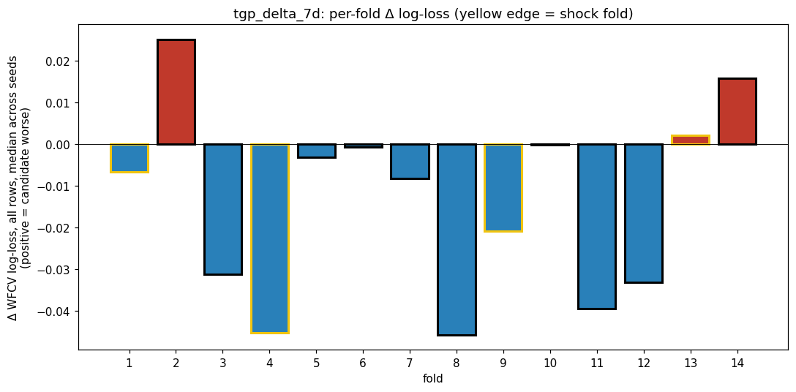
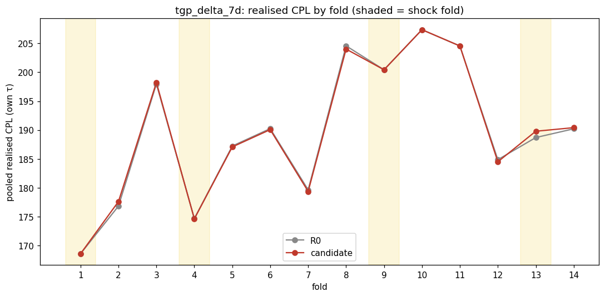
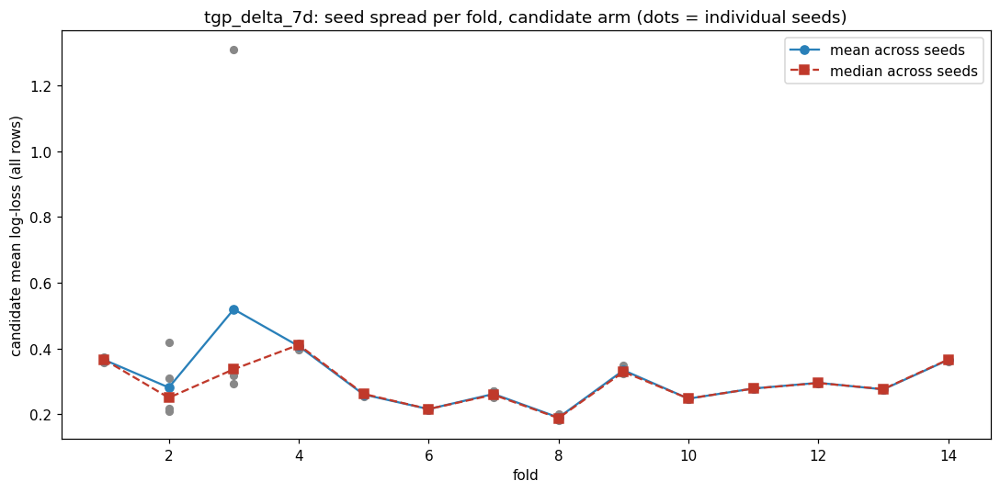
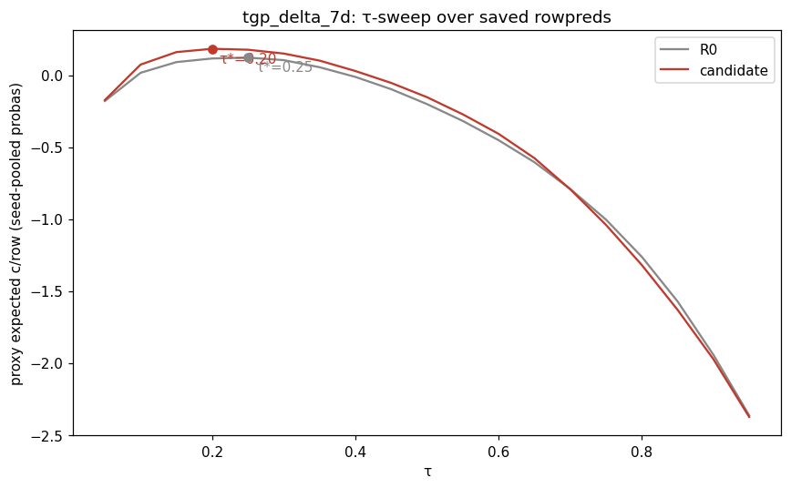
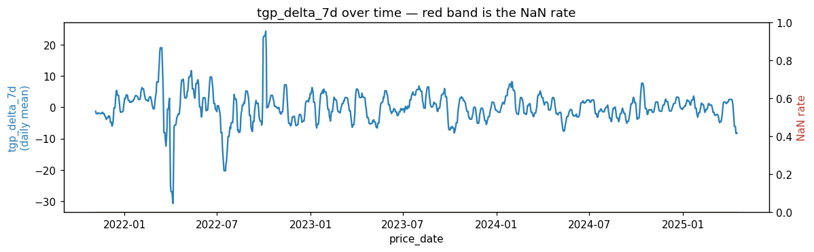
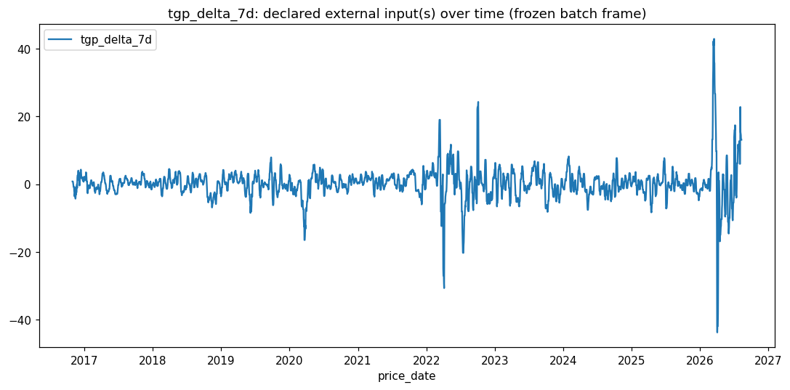

# batch0 / tgp_delta_7d — pipeline re-lock check

- **Date:** 2026-08-18
- **Branch:** main
- **SHA:** 94cdfef78f461c4687e026627f3f7673505a35b8
- **Status:** done
- **Bead:** fps-32p

## Hypothesis

7-day AIP Sydney TGP (wholesale floor) momentum predicts near-term retail descent,
concentrating in shock regimes where today's wholesale-floor position alone
misleads (the raw gap `station_minus_tgp_cents` helps calm but hurts shock;
`tgp_delta_7d` was supposed to rescue exactly that shock regression). Already
graduated the realised arbiter once, 2026-06-22
(`experiments/2026-06-20_leading_indicators/`, pooled −0.039 c/L, 14 WF folds).
This run is the AI-sourced pipeline's held-out re-lock check on that same claim,
not a new proposal — batch0 was purpose-built as the pipeline's known-graduate
sanity check.

## How to invoke this script

```bash
PYTHONPATH=. uv run python -m experiments.pipeline.launch --candidate experiments/candidates/batch0/tgp_delta_7d.py
```

## Facts

All numbers below are transcribed from `facts.json` in this directory — no new
arithmetic.

**Provenance:** batch `batch0`, snapshot 2026-08-10, seeds [42, 43, 44, 45, 46],
wall time 2022.1s, bead `fps-32p`, pipeline status `rejected`.

**Headline (realised CPL, held τ — the arbiter):**

| | R0 (baseline) | candidate | delta |
|---|---|---|---|
| CPL held | 189.66 | 189.7541 | **+0.0941** |

`effect_resolved`: **false**. Zone: not resolved — `CONFIDENCE_EFFECT` (0.9) did
not resolve true, so this run scored conditionally rather than against a
sign+magnitude gate.

**WFCV log-loss** (descriptive colour only, NOT the arbiter — see
`docs/CONVENTIONS.md` #250/#254, flat WFCV log-loss has shown opposite realised
outcomes before): Δll_all mean across folds −0.0106, Δll_hard25 mean −0.0498 —
both favour the candidate. Disagrees with the realised-CPL headline.

**Per-regime breakdown** (min cell n=30, nothing suppressed):

| regime | n_fills | delta_cpl_own |
|---|---|---|
| shock | 218 | **+0.2720** |
| normal | 535 | +0.0093 |

**Per-fold, shock folds only** (the axis the hypothesis targets):

| fold | n_fills | delta_cpl_own | seed-flagged? |
|---|---|---|---|
| 1 | 51 | 0.0000 | no |
| 4 | 54 | −0.0469 | no |
| 9 | 57 | 0.0000 | no |
| 13 | 56 | **+1.0923** | no |

(Full 14-fold table, all regimes, is in `facts.json`.)

**Seed stability:** `seed_flags` lists 8 cells exceeding 5× the cohort-median
seed_std. The largest is fold 3 (normal regime), R0 seed_std=1.595 — **~280×**
the cohort median — and its candidate-side counterpart at ~90×. Folds 2 and 4
also flag at 8–13×. None of the four **shock** folds are flagged, so fold 13's
+1.09 is not a seed-noise artifact.

**Validation:** PIT test passed (reached WFCV/realised stages — no leak).
INPUTS check passed. `tgp_delta_7d` NaN rate: 0.0%.

**Noise floor:** not available yet (`fps-3jj.9`, P3, not built) — no way yet to
check whether +0.0941 c/L clears a noise band or sits inside one.

**Plots:** `per_fold_delta_bars.png`, `seed_mean_vs_median.png`,
`realised_cpl_by_fold.png`, `tau_sweep.png`, `candidate_over_time.png`,
`external_series_overlay.png`.








## Diagnostic — implementation-mismatch check (2026-08-18, post-dossier)

The `not_tested` item below about the harness's `add_columns`/exact-key-lookup
provider vs June's `.asof`-by-date closure was checked directly:
`diagnostic_asof_provider.py` (this directory) reruns the identical frozen
batch0 snapshot/seeds/fold geometry, but replaces the harness's exact
`(station_code, date)` lookup (822 hits / 88 misses in the run above) with a
date-only `.asof()` lookup matching June's `vel7_provider` exactly — valid
because `tgp_delta_7d` is confirmed market-wide (one value per date, verified
`nunique()==1` across stations before the run).

**Result: bit-identical to the harness's run.** 910/910 hits, 0 misses, pooled
`delta_cpl_held = +0.0941` — same to the decimal, same per-fold table across
all 14 folds, fold 13 unchanged at +1.0923. Full output:
`diagnostic_asof_provider.log`.

**This rules out the implementation-mismatch explanation.** The 88 exact-key
misses in the original run evidently never touched an economically live
decision (LightGBM's missing-value handling made no difference to any
buy/no-buy call on those station-days) — a faithful reproduction of June's own
method gives the same result. The rejection is not a plumbing artifact.

## Judgement

**Grading verdict: contradicted.** The predicted signature was a negative
pooled delta concentrated in shock. The pooled delta is positive (+0.0941,
worse) — opposite sign — so this fails the batch's pre-registered
sign+concentration pass criterion on sign alone, regardless of magnitude. The
concentration-in-shock axis called correctly (shock moves more than normal),
but in the wrong direction: shock is where the candidate hurts most, not where
it rescues the raw gap's known shock weakness. And even that pooled shock
number isn't a broad pattern — three of four shock folds are flat or mildly
helpful; fold 13 alone (+1.09, not seed-flagged) accounts for essentially all
of the pooled shock harm.

**not_tested:**

- ~~Whether the original `extra_feature_provider` closure implementation
  reproduces the negative pooled effect~~ — **tested 2026-08-18, see Diagnostic
  section above: bit-identical result.** Ruled out as an explanation; the
  candidate's own predicted-signature caveat about `add_columns` vs
  `extra_feature_provider` does not hold up.
- Whether fold 13 reflects a specific historical event where wholesale-floor
  velocity actively misled (a real, narrow failure mode worth understanding)
  versus a general property of shock regimes — only 4 shock folds exist here,
  and one drives the entire pooled shock number.
- Fold 3's extreme seed instability (~280× cohort median) sits inside the
  "normal" pooled average; whether a wider seed sweep changes the normal-regime
  read at all is untested.
- Whether +0.0941 c/L is distinguishable from pipeline noise — genuinely
  unknown, not just unfavourable, until `fps-3jj.9` lands a noise floor for
  this batch.

**Recommendation:** Not a re-lock candidate on this evidence — the
pre-registered sign+concentration criterion fails cleanly on sign, and the
2026-08-18 diagnostic closed off the one confound that could have explained
the flip as an artifact. What's left is a single outlier fold (13) driving
the whole pooled shock number, and an untested question of whether the June
effect genuinely decayed on the later data vintage — real open ground for a
future look, but no basis to pull `tgp_delta_7d` into `FEATURE_COLUMNS` right
now. Confirms the standing call to hold off on the TGP re-lock (`#271`).

## Followups

- **New lead, not yet investigated (2026-08-18): the R0 baseline itself
  changed between June and now, and this looks like the strongest candidate
  explanation.** batch0's 64-column baseline (`baseline_columns.json`) is
  June's exact 54 `BASE` columns (`FEATURE_COLUMNS + LGA_FEATURE_COLUMNS +
  NETWORK_FEATURE_COLUMNS`) **plus 10 brand-trough columns**
  (`days_since_trough_entry_<brand>`, one per brand) that did not exist when
  `tgp_delta_7d` graduated in June. Brand-trough distance and TGP-floor
  distance are thematically adjacent — both are "how close to the bottom"
  signals — so it's plausible `tgp_delta_7d`'s incremental value shrank or
  reversed simply because the baseline it's now being measured against
  already captures a related signal it didn't have to compete with in June.
  This is a concrete, testable, and previously un-flagged mechanism — more
  specific than a vague "data vintage" story, and doesn't require assuming
  the world itself changed. See handover bd issue (filed below) for the
  starting point.
- `fps-3jj.9` (noise floor, P3, dormant) would let a future re-run check
  +0.0941 c/L against an actual noise band instead of reading it in isolation.
- Whether the June→now data vintage shift (rather than the baseline
  composition above) explains the flip is still open — e.g. rerunning June's
  original three-arm script against current data with June's ORIGINAL
  54-column baseline (not batch0's 64), or digging into what actually
  happened around fold 13's window (2024-10-20→2025-01-17) specifically.
