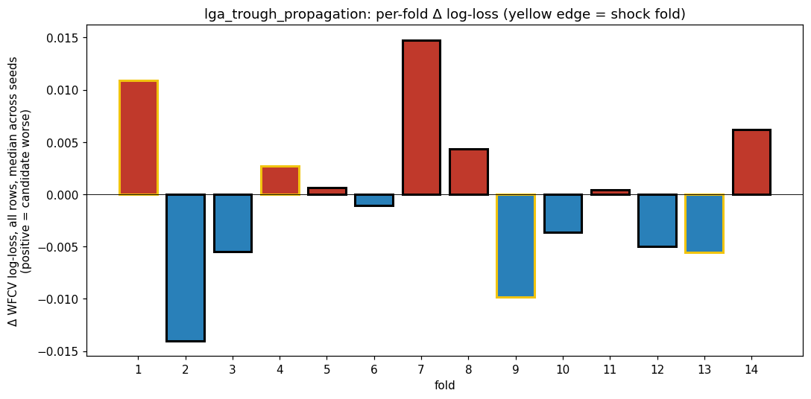
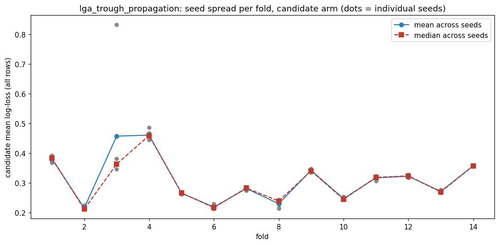
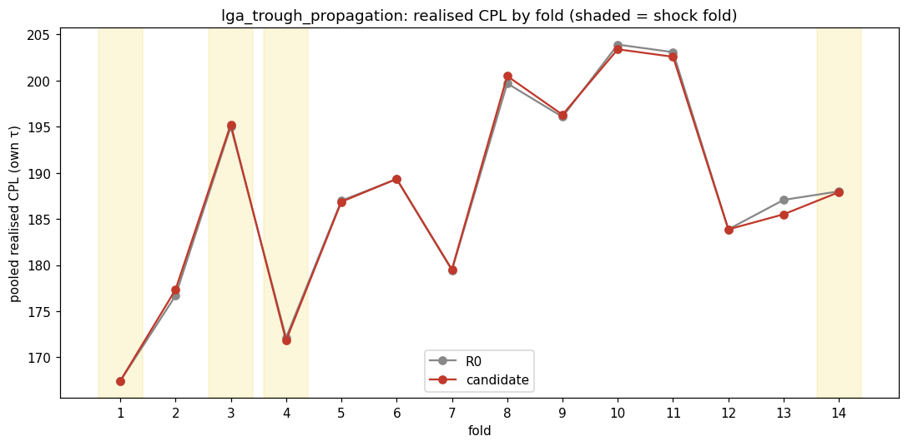
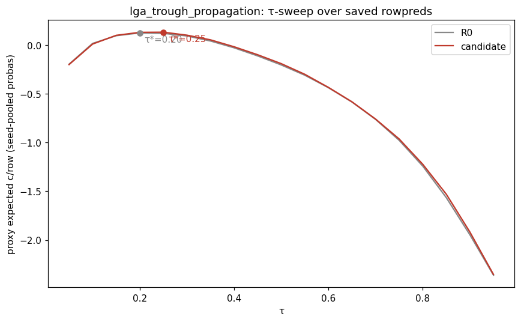
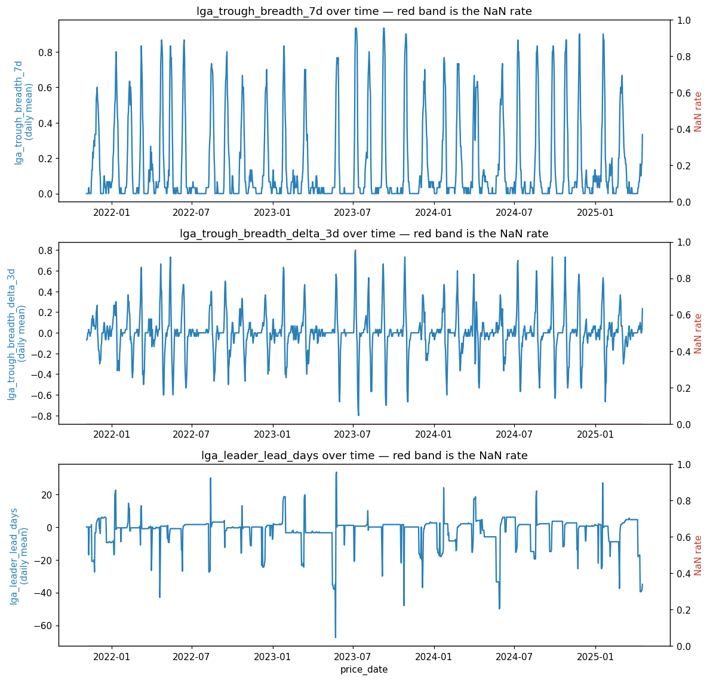

# batch1 / lga_trough_propagation

- **Date:** 2026-08-15 (snapshot) / dossiered 2026-08-26
- **Branch:** main
- **SHA:** b8c01f8aa5e73d9ceaa57f7d41b9ec9393b5dd61
- **Status:** done — **inconclusive**
- **Bead:** fps-cgf
- **Cadence:** `50/3.571/1d/10%` (batch1's canonical daily cadence)

## Hypothesis

The Sydney trough is not a moment, it is a wave: individual LGAs bottom on
different days and the wave runs from a known set of early LGAs outward. The
35 `days_since_trough_entry_<lga>` clocks are all in the lock, but the model
reduces them through 35 axis-aligned splits, and the one cross-sectional
summary it is handed (`lga_phase_std`) is a dispersion statistic — sign-blind
and order-blind. Std cannot distinguish "a third of the network has just
bottomed and the rest is about to follow" from "a third bottomed six weeks
ago and the rest is mid-descent," yet those are opposite buy/wait situations.
Breadth (`lga_trough_breadth_7d`), its velocity
(`lga_trough_breadth_delta_3d`), and the leaders' head start
(`lga_leader_lead_days`) recover exactly what the std discards.

**Predicted signature:** the model should keep waiting while
`lga_trough_breadth_delta_3d` is positive and `lga_leader_lead_days` is large
(the wave is still arriving), and should buy once breadth velocity rolls
over toward zero with leader lead already collapsed. Flips should be
WAIT→BUY moves a few days earlier than the lock manages, **concentrated on
non-shock folds** — the wave is a property of the ordinary cycle, and a
shock's wholesale move overrides propagation order entirely. Falsification
signature: gains driven by `lga_trough_breadth_7d`'s LEVEL alone with the
velocity and leader-lead columns inert.

## How to invoke this script

```bash
PYTHONPATH=. uv run python -m experiments.pipeline.runner \
  --batch-dir experiments/batches/batch1 \
  --candidate experiments/candidates/batch1/lga_trough_propagation.py
```

## Facts

Transcribed from `facts.json` — no new arithmetic.

**Provenance:** batch `batch1`, snapshot 2026-08-15, seeds [42, 43, 44, 45,
46], wall 1270.9s, status `graded`, 54-column baseline (`54:1a6ec2d84a69`).
Those five seeds are the **WFCV screen only**. The realised backtest — the arbiter —
ran on a **single seed** (`results.json` `meta.realised_seed` = 42); `facts.json`'s
provenance block does not carry this field. That is provenance, not a missing error
bar: the realised delta is a PAIRED difference in which both arms share the seed, the
data, the folds and the 54 baseline columns, so the fit's seed idiosyncrasy is
common-mode and cancels. Its error bar is the noise floor, built the same paired way
at the same fixed seed (`PLACEBO_SEED_DEFAULT = SEEDS[0]` = 42).

**Headline (realised CPL, held τ — the arbiter):**

| | R0 | candidate | delta |
|---|---|---|---|
| CPL held | 187.8211 | 187.7537 | **-0.0675** |

`effect_resolved`: **true**.

**WFCV log-loss** (descriptive colour, NOT the arbiter): Δll_all mean
-0.0003, Δll_hard25 mean -0.0053. Both favour the candidate, marginally.

**Zone (regime axis — safe to cut; a fold is an independent simulation, not
a row-label slice). Target = normal (the concentration the candidate
predicted), other = shock:**

| | target (normal) | other (shock) |
|---|---|---|
| delta_cpl_own | +0.0463 | -0.3794 |
| n_fills | 1633 | 693 |

`resolved`: **false** — the target zone (normal) is slightly WORSE for the
candidate, and the entire favourable effect sits in the zone the candidate
predicted would be inert.

**Per-fold:**

| fold | regime | n_fills | delta_cpl_own |
|---|---|---|---|
| 1 | shock | 190 | 0.0000 |
| 2 | normal | 186 | +0.6506 |
| 3 | normal | 188 | +0.2313 |
| 4 | shock | 239 | -0.0732 |
| 5 | normal | 185 | -0.1116 |
| 6 | normal | 135 | +0.0323 |
| 7 | normal | 235 | +0.0530 |
| 8 | normal | 87 | +0.7971 |
| 9 | shock | 112 | +0.2326 |
| 10 | normal | 96 | -0.5082 |
| 11 | normal | 161 | -0.5000 |
| 12 | normal | 184 | -0.0078 |
| 13 | shock | 143 | **-1.5646** |
| 14 | normal | 165 | -0.0864 |

No cell is suppressed (`min_row_cell_n` = 30, smallest cell here is 87).

`per_axis` is `null` — this candidate declared no `add_axis` beyond the
regime split above, so there is no path-coupled per-row zone to caveat here.

**Seed stability:** 7 cells exceed 5× the cohort-median seed_std. Six sit in
the ordinary 5.4–6.6× range (fold 2 `all`/R0, fold 3 `all`/R0, fold 2
`hard25`/R0, fold 3 `hard25`/R0, fold 3 `hard25`/candidate, fold 5
`hard25`/R0). The seventh is an outlier among the outliers: **fold 3, `all`
cohort, candidate run, 75.4× the cohort median** — an order of magnitude
past every other flagged cell. Fold 3 is a `normal` (target-zone) fold and
is also the single worst per-fold flip-delta in the table below.

Every `seed_std` here is **WFCV log-loss**, not realised CPL —
`experiments/lib/gates.py`'s `seed_variance_gate` runs on `ll_all`/`ll_hard25`.
Fold 3's raw candidate `seed_std` is 0.5359 against a `Δll_all` of -0.0003: the
fit's seed noise is ~1700× the log-loss effect being measured. The blow-up is in
the EASY rows — the `hard25` cell for the same fold/arm is only 6.6×.
**No seed-variance measurement on CPL exists in this run.**

**Validation:** PIT passed (differential PIT truncation test found no
leak). INPUTS check passed. Candidate column NaN rate 0.0% for all three
columns.

**Noise floor** (`experiments/batches/batch1/noise_floor.json`, 10 draws at
arity 3 — matches this candidate's 3-column arity, `floor_arity_exceeds_run`:
false): band mean +0.0251 c/L, band std 0.0999 c/L. The candidate's -0.0675
c/L sits at the 80th percentile of the 10 observed noise draws
(`candidate_percentile_better_than_noise` = 80.0), and the parametric
single-candidate call is `z = -0.93` against a threshold of `t = 1.92`:
inside the band, not past it either direction.

**Decision flips** (`facts["decision_flips"]`, diffs R0's and the
candidate's `fills.parquet` directly on `(fold, station_code, date)`): **272
total flips**. Per fold:

| fold | regime | n_baseline_only | n_candidate_only | flip_cpl_baseline | flip_cpl_candidate | flip_cpl_delta |
|---|---|---|---|---|---|---|
| 1 | shock | 0 | 0 | — | — | — |
| 2 | normal | 38 | 24 | 184.25 | 184.33 | +0.08 |
| 3 | normal | 9 | 6 | 187.74 | 198.53 | **+10.78** |
| 4 | shock | 23 | 26 | 187.23 | 181.02 | -6.21 |
| 5 | normal | 15 | 18 | 191.41 | 188.15 | -3.26 |
| 6 | normal | 11 | 13 | 184.95 | 185.83 | +0.88 |
| 7 | normal | 5 | 5 | 180.89 | 172.70 | -8.19 |
| 8 | normal | 10 | 9 | 188.79 | 195.62 | +6.82 |
| 9 | shock | 0 | 6 | — (no baseline-only fills) | 181.06 | — |
| 10 | normal | 5 | 11 | 200.81 | 189.70 | -11.11 |
| 11 | normal | 3 | 3 | 221.99 | 202.28 | -19.72 |
| 12 | normal | 5 | 4 | 184.73 | 182.66 | -2.06 |
| 13 | shock | 9 | 6 | 199.54 | 180.48 | **-19.05** |
| 14 | normal | 6 | 2 | 182.95 | 177.50 | -5.45 |

Fold 1's delta is unavailable (both arms have zero differing fills — no
flips at all that fold). Fold 9 mirrors the same shape seen in this batch's
`network_move_breadth` dossier: zero baseline-only fills against 6
candidate-only ones, i.e. "candidate bought more often" rather than "the two
arms swapped timing."







## Judgement

**Signature grading: contradicted.** The candidate specifically predicted
concentration in non-shock (normal) folds, with shock folds inert because a
shock's wholesale move overrides propagation order. The pipeline's own zone
test contradicts this directly: `resolved=false`, the target (normal) zone
is slightly WORSE for the candidate (+0.0463 c/L) while the entire
favourable effect sits in the zone predicted to be inert (shock,
-0.3794 c/L). This is the reverse of the predicted mechanism, not merely an
absence of one — echoing the same shape this batch's `station_descent_dynamics`
dossier found for its own zone test. The aggregate is also statistically
inconclusive on top of pointing the wrong way: -0.0675 c/L held-τ sits
inside batch1's single-candidate noise band (z=-0.93 vs t=1.92).

The flip-level detail is colour, not a second arbiter (per
`docs/routines/dossier.md`'s guardrail), but two things stand out. First,
fold 3 — a normal (target-zone) fold — carries both the single worst
flip-delta (+10.78 c/L, the candidate's worst fold) and a 75.4×
cohort-median seed_std for the candidate run, an order of magnitude past
every other flagged cell in this run. That combination makes fold 3's
contribution to the normal-zone read look more like an unstable draw than a
reliable signal either way. Second, the two largest favourable flip-deltas
(fold 11, -19.72 c/L, normal; fold 13, -19.05 c/L, shock) straddle the
regime boundary much like `network_move_breadth`'s folds 11–13 cluster did —
raising the same open question that dossier flagged: is there a real
calendar-clustered event in that window that both candidates' columns
happen to catch, independent of the regime label each candidate was
actually built to key off?

**not_tested:**

- Whether the propagation-wave mechanism helps at all within ordinary
  (non-shock) cycles — the regime it was built for. The observed sign there
  is negative, not merely flat, but fold 3 (the worst offender) is also the
  most seed-unstable cell in the run; a wider seed sweep or a fold-3-excluded
  re-read would separate "the mechanism mildly hurts in normal folds" from
  "fold 3 is a noisy draw distorting the normal-zone average."
- The candidate's own proposed falsification test — whether gains trace to
  `lga_trough_breadth_7d`'s level alone with velocity/leader-lead columns
  inert — is untested here; it needs per-column SHAP/attribution against the
  candidate's fitted model, which this pipeline doesn't currently persist
  (same gap `network_move_breadth`'s dossier already named).
- Whether there's a real shock-fold restoration mechanism here (distinct
  from what was proposed) — **fold 13 alone** shows a large favourable effect
  during a shock, which the candidate never predicted and this run cannot
  distinguish from a single unusual window. (An earlier revision said "folds 4
  and 13"; fold 4 is -0.0732 c/L — noise. See the addendum.)
- Whether combining this with `network_move_breadth` (same batch, same
  cross-sectional-consensus family, same folds 11–13 pattern) does better
  than either alone — flagged from both sides now.

**Recommendation:** dead end on the propagation-during-ordinary-cycles
framing as stated — the evidence points the opposite way from the
prediction, and the one fold most responsible for that reading is also the
most seed-unstable in the run. There may be a genuine shock-fold mechanism
worth reframing as its own hypothesis, but it rests on **fold 13 alone**, and
fold 1 — another shock fold — turns out to be a measurement gap rather than a
null (see the addendum). It should be
checked jointly with `network_move_breadth` before either is pursued
further, since both candidates in this batch cluster their wins in the same
fold window through mechanisms neither one predicted.

## Followups

- Per-column SHAP/attribution for this candidate's fitted model remains
  unbuilt (same gap noted in `network_move_breadth`) — worth its own bead if
  a future candidate's grading comes to depend on it, rather than building
  it speculatively now.
- If the batch retrospective revisits the folds-11-13(-4) cluster shared
  between this candidate and `network_move_breadth`, treat it as one
  question, not two.

## Review addendum — 2026-08-26

A later interactive review of this dossier. Everything below is new analysis on the
same run, kept out of Facts because it is not transcription from `facts.json`; each
item names its own source. **The `contradicted` verdict is unchanged** — it rests on
the target (normal) zone being wrong-signed, which none of this touches.

**1. The shock-zone effect is one fold, not a zone.** Decomposing
`per_regime`'s shock `delta_cpl_own` of -0.3794 over its four folds (fill-count
weighted, so approximate — the reported figure is litre-weighted `pooled_cpl`, and
`fills.parquet` was not retained):

| fold | delta_cpl_own | n_fills | share of shock net |
|---|---|---|---|
| 1 | 0.0000 | 190 | 0% (zero flips either way) |
| 4 | -0.0732 | 239 | 8% |
| 9 | **+0.2326** | 112 | -12% (against) |
| 13 | -1.5646 | 143 | **104%** |

Excluding fold 13, the shock zone reads **+0.016** — sign flipped. The band's 0.0999
std is on the *pooled* 14-fold delta, so a single fold's null is roughly √14× wider
(~0.37); on that ruler fold 4 is 0.2σ, fold 9 is 0.6σ, and only fold 13 (4.2σ) is
distinguishable. The Judgement's original "folds 4 and 13" is corrected above.

**2. Folds 1-8 ran on a reduced station universe; folds 9-14 did not.** All 607 of
this run's `extra_feature_provider_misses` (`results.json` `meta`; 6300 requested =
5 preferred stations × 14 folds × 90 days) are station-days where two Blue Mountains
stations have no feature row:

| fold | window | missing | which |
|---|---|---|---|
| 1 | 2021-11-05..2022-02-02 (shock) | **180/450** | 414 and 18517, all 90 days |
| 2 | 2022-02-03..2022-05-03 | 8 | 414, 18517 |
| 4-8 | 2022-08-02..2023-10-25 | 67/90/90/90/82 | 414 |
| 9-14 | — | 0 | clean |

Verified against `data/cleaned/` raw prices: **the 2021 gap is not a closure.** Both
stations kept reporting through it (414: 44 raw rows inside; 18517: 75), at ~1/3 their
prior update rate — sparse enough to trip `fill.py`'s 28-day fill cap, after which
`labels.py` strips 7 days before and 90 after. 414's 2022-23 gap **is** a real
year-long rebuild (zero raw rows 2022-09..2023-04), but it reopened ~2023-07 while the
feature frame stays dark to 2023-10-17, so **fold 8's 82 missing days are label-strip
tail on a live, trading station.**

Consequences: fold 1's `delta_cpl_own` = 0.0000 with zero decision flips comes
from a 3-station fold. Coverage is not the whole explanation — this batch's other
two candidates do flip decisions in fold 1 (`network_move_breadth` 4/2,
`station_descent_dynamics` 21/0) — but a fold missing both of its dark stations
from the SAME council is a thin substrate for an LGA-propagation feature
specifically, so read the zero as thinned rather than as a clean null — and the council mix flips from 3 Blue Mountains /
2 Penrith to 1/2, which matters for a candidate whose mechanism is LGA propagation
(Blue Mountains lags the network trough by -1.45 days, Penrith by -1.14). Folds 4-7
are honest 4-station markets. Fold 1 and fold 8 are measurement gaps. Note this is
reduced sample, **not corrupted sample** — a missing feature row means no fill was
available and both arms skip it identically.

**3. The candidate's own falsification test is partly answerable already.** It asks
whether this is `lga_phase_std` in different clothes. `experiments/candidates/batch1/batch.json`
retains the generation-time R² of each column against the 54-column lock:

```
block_r2  0.685   (BLOCK_R2_FLAG = 0.9 — advisory, did not fire)
  lga_trough_breadth_7d        0.705
  lga_trough_breadth_delta_3d  0.497
  lga_leader_lead_days         0.855
```

The most-reconstructible member is **`lga_leader_lead_days`**, not the breadth level
the falsification test named. Note the block figure is the *mean* of the members, which
dilutes a single redundant column by design (`docs/routines/generator.md` § Redundancy),
and the hard |rho| >= 0.85 gate is **cross-candidate only** — it never compares a
candidate to the lock. Neither number reaches `facts.json`, so the original grading
could not see them. Correlation is not the model's *use* of a column, so this is
corroboration, not proof — but it is independent of any attribution machinery, and it
points the same way as fold 3's seed instability.

**4. Retention gap.** Neither `fills.parquet` nor the fitted model was kept, so the
fold-3-excluded re-read proposed in `not_tested` cannot actually be run against this
run's artifacts — it needs a full re-run. Worth more than the SHAP stage the Followups
contemplate.
