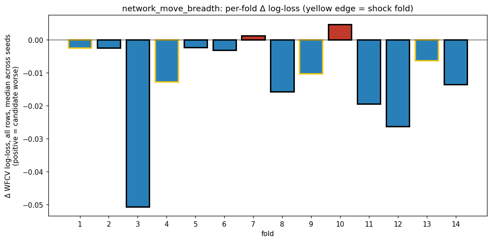
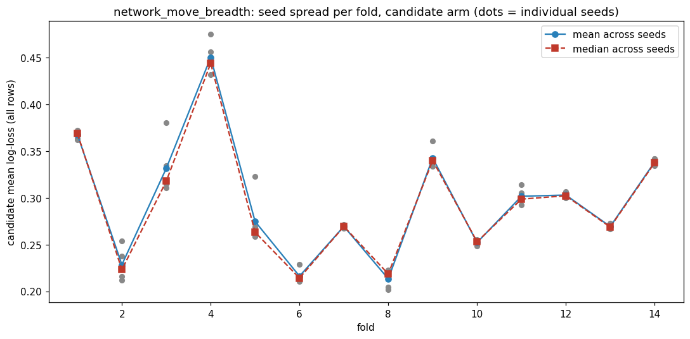
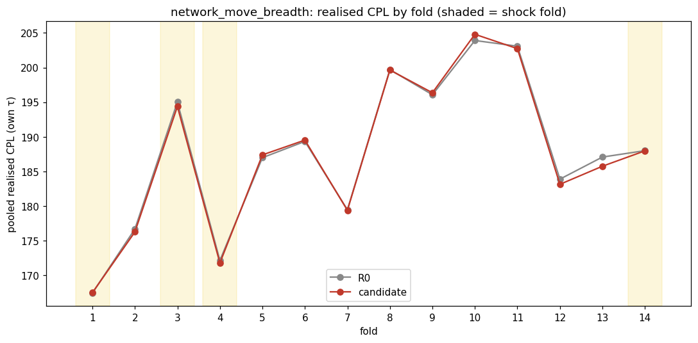
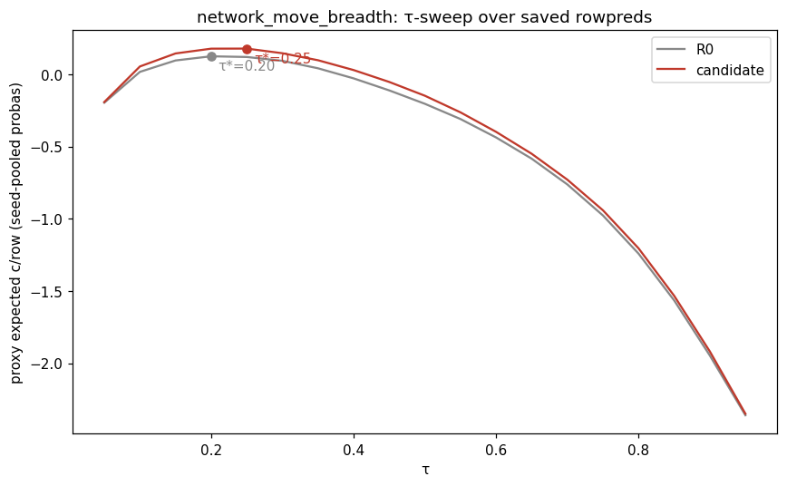
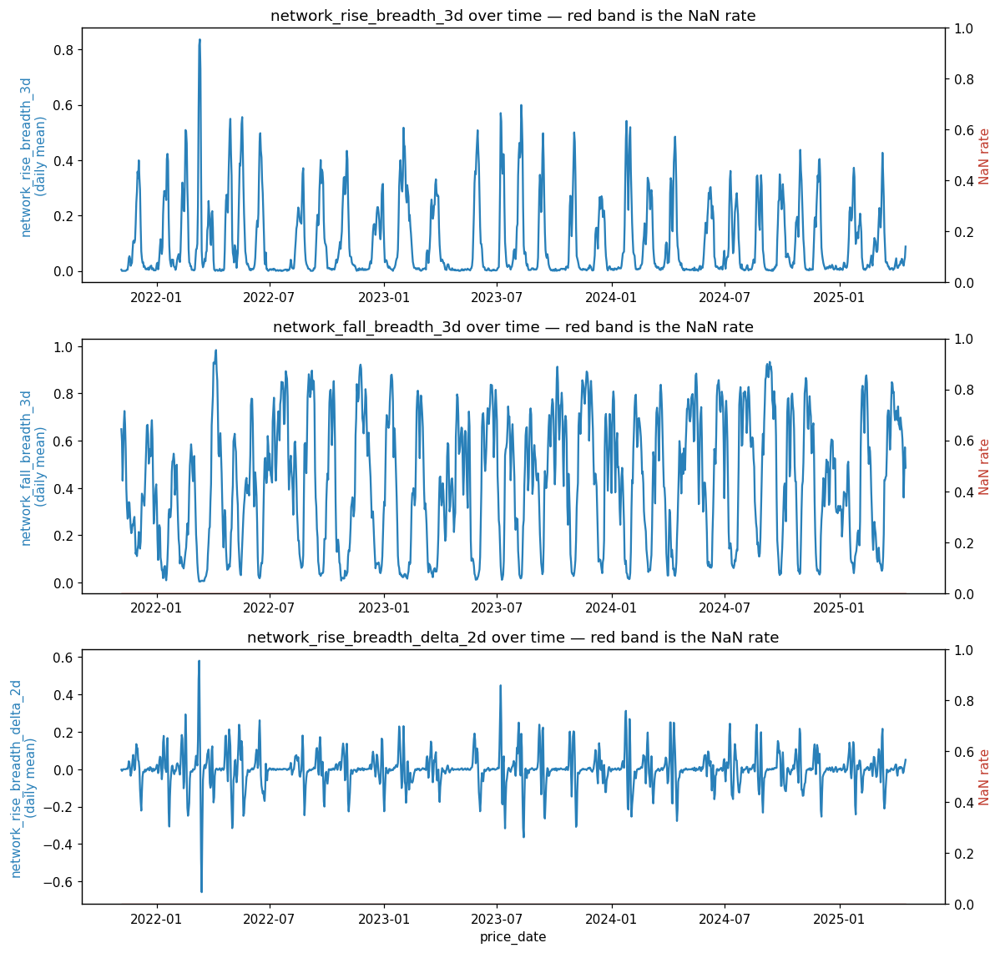
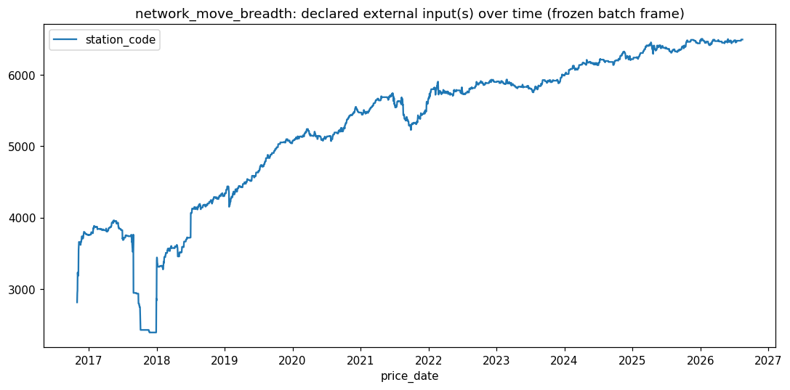

# batch1 / network_move_breadth

- **Date:** 2026-08-15 (snapshot) / dossiered 2026-08-24
- **Branch:** main
- **SHA:** 19b65549181cd94bca63fffde682f180faabd606
- **Status:** done — **inconclusive**
- **Bead:** fps-2l9
- **Cadence:** `50/3.571/1d/10%` (batch1's canonical daily cadence)

## Hypothesis

A Sydney cycle ends with a coordinated restoration: a subset of stations jumps
20–30 c/L within a day or two, and the rest follow over the next few days.
`network_px_std` measures the spread of the cross-section and is invariant to
direction, so it can't tell "a few stations jumped up" from "a few stations
dropped down." Counting the share of stations moving up vs. down over a fixed
window (`network_rise_breadth_3d`, `network_fall_breadth_3d`,
`network_rise_breadth_delta_2d`) recovers that sign, as a participation count
robust to the size of any one station's jump.

**Predicted signature:** rows where `network_rise_breadth_delta_2d` turns
sharply positive should flip WAIT→BUY one to three days earlier than the lock
manages, with a large per-flip saving (a restoration is worth 20–30 c/L vs.
~1–2 c/L for a day of descent) — i.e. a **few large flips**, concentrated on
**shock folds**, with `network_fall_breadth_3d` mostly pushing the opposite
direction (WAIT longer).

## How to invoke this script

```bash
PYTHONPATH=. uv run python -m experiments.pipeline.runner \
  --batch-dir experiments/batches/batch1 \
  --candidate experiments/candidates/batch1/network_move_breadth.py
```

## Facts

Transcribed from `facts.json` — no new arithmetic.

**Provenance:** batch `batch1`, snapshot 2026-08-15, seeds [42, 43, 44, 45, 46],
wall 1782.6s, status `graded`, 54-column baseline (`54:1a6ec2d84a69`).

**Headline (realised CPL, held τ — the arbiter):**

| | R0 | candidate | delta |
|---|---|---|---|
| CPL held | 187.8211 | 187.6659 | **-0.1552** |

`effect_resolved`: **true**.

**WFCV log-loss** (descriptive colour, NOT the arbiter): Δll_all mean
-0.0114, Δll_hard25 mean -0.0570. Both favour the candidate.

**Zone (regime axis — safe to cut; a fold is an independent simulation, not a
row-label slice):**

| | target (shock) | other (normal) |
|---|---|---|
| delta_cpl_own | -0.3065 | -0.0925 |
| n_fills | 705 | 1619 |

`resolved`: **true** — shock is more negative than normal, in the direction
the candidate predicted.

**Per-fold:**

| fold | regime | n_fills | delta_cpl_own |
|---|---|---|---|
| 1 | shock | 188 | +0.0573 |
| 2 | normal | 197 | -0.4233 |
| 3 | normal | 178 | -0.6392 |
| 4 | shock | 239 | -0.1729 |
| 5 | normal | 185 | +0.3301 |
| 6 | normal | 127 | +0.1767 |
| 7 | normal | 232 | -0.0622 |
| 8 | normal | 88 | -0.0602 |
| 9 | shock | 112 | +0.2894 |
| 10 | normal | 96 | +0.8968 |
| 11 | normal | 161 | -0.3535 |
| 12 | normal | 177 | -0.7462 |
| 13 | shock | 146 | **-1.3250** |
| 14 | normal | 168 | -0.0281 |

No cell is suppressed (`min_row_cell_n` = 30, smallest cell here is 88).

`per_axis` is `null` — this candidate declared no `add_axis` beyond the
regime split above, so there is no path-coupled per-row zone to caveat here.

**Seed stability:** 5 cells exceed 5× the cohort-median seed_std, all on run
R0 — folds 2 and 3 (`all` cohort) and folds 2, 3, 5 (`hard25` cohort), each
around 5.4–6.0× the median. None of the four shock folds appear in this list.

**Validation:** PIT passed (differential PIT truncation test found no leak).
INPUTS check passed. Candidate column NaN rate 0.0% for all three columns.

**Noise floor** (`experiments/batches/batch1/noise_floor.json`, 10 draws at
arity 3 — matches this candidate's 3-column arity, `floor_arity_exceeds_run`:
false): band mean +0.0251 c/L, band std 0.0999 c/L. The candidate's -0.1552
c/L sits at the **100th percentile** of the 10 observed noise draws
(`candidate_percentile_better_than_noise` = 100.0 — better than every one of
them), but the parametric single-candidate call is `z = -1.80` against a
threshold of `t = 1.92`: inside the band, not past it.








## Judgement

**Signature grading: inconclusive.** The regime breakdown points the right
way (shock -0.3065 c/L vs. normal -0.0925 c/L, matching the predicted shock
concentration), but almost all of the shock effect is one fold (13, -1.325)
while the other three shock folds are flat-to-worse (+0.057, -0.173, +0.289) —
consistent with a rare, violent restoration paying big when caught, but also
consistent with one outlier carrying the aggregate. The headline realised
delta (-0.1552 c/L) sits inside this batch's single-candidate noise band, so
the effect isn't resolved as real against the ruler. `facts.json` has no
decision-flip count or per-column (rise vs. fall breadth) attribution, so the
signature's more granular claims — few large flips, and the two columns
pushing in opposite directions — can't be checked from what's recorded here.

**not_tested:**

- **Per-decision-flip attribution.** The predicted mechanism is specifically
  about a *few large flips*, not a smooth pooled delta — that's exactly what
  this run's facts can't distinguish from "one lucky shock fold." A follow-up
  that counts buy/wait flips attributable to `network_rise_breadth_delta_2d`
  crossing a threshold, and sizes each flip's saving, would test the
  mechanism directly rather than through a fold-aggregate proxy.
- **The rise/fall asymmetry.** Nothing here checks whether
  `network_fall_breadth_3d` is actually pushing WAIT longer as predicted, or
  whether it's inert (or even reinforcing) — that needs per-column
  attribution (e.g. SHAP interaction values) this dossier doesn't have.
- **Whether fold 13 is the restoration mechanism or an outlier.** The batch's
  own noise-floor draws are only n=10; a candidate that beats all 10 by this
  much but still falls inside the ±t parametric band is a case where more
  draws (or a fold-level bootstrap) might resolve the tension between the
  100th-percentile empirical read and the "inconclusive" parametric one.
- The three columns here are one arm of a two-candidate cross-sectional-
  consensus filing in this batch (see `lga_trough_propagation`, same batch) —
  whether a combined rise/fall breadth + LGA-trough feature does better than
  either alone is untested.

**Recommendation:** not a graduation candidate on this run — the headline
sits inside the batch's own noise floor — but not dead ground either. The
regime split lands where the hypothesis said it would, and the miss is
plausibly a measurement-resolution problem (fold-level aggregation smearing
out a few-large-flips effect) rather than a wrong mechanism. Worth a second
look with per-flip attribution before deciding whether to re-propose this
series, rather than treating -0.1552 c/L as the final word.

## Followups

- None filed yet. A per-decision-flip attribution tool (see not_tested above)
  would be generically useful for any future "decision-timing" candidate in
  this family, not just this one — worth a `design` bead if a future session
  wants to build it rather than re-deriving it per candidate.
