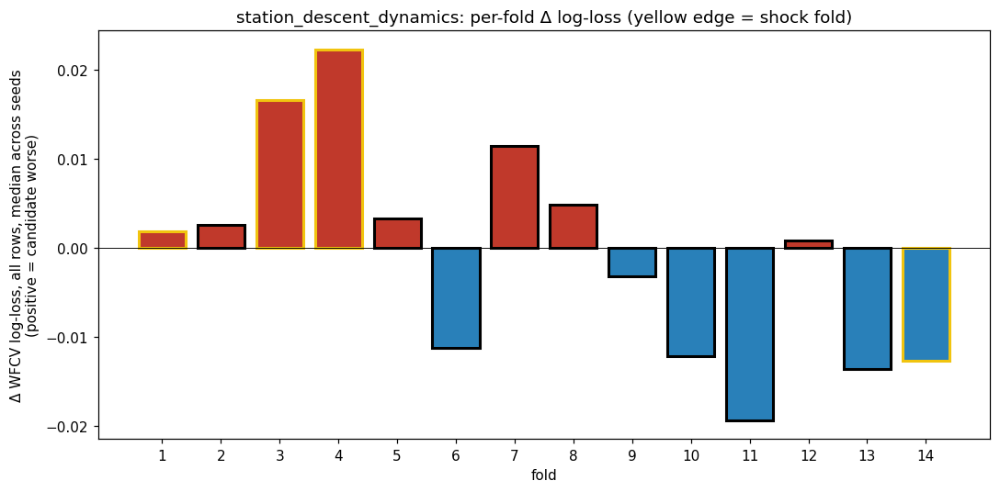
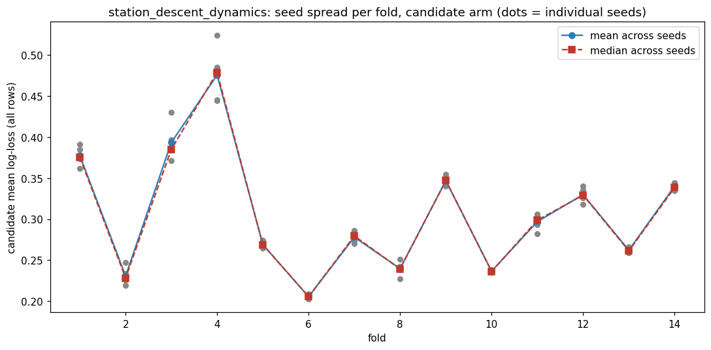
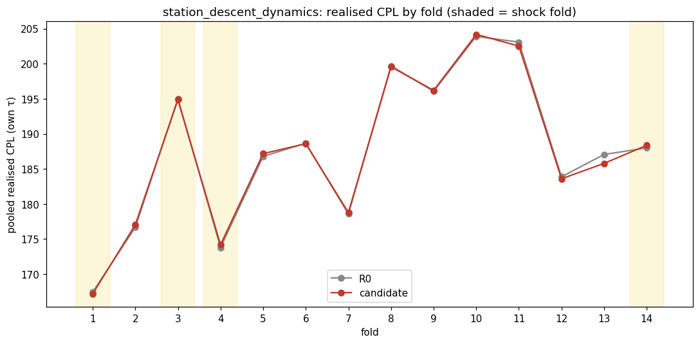
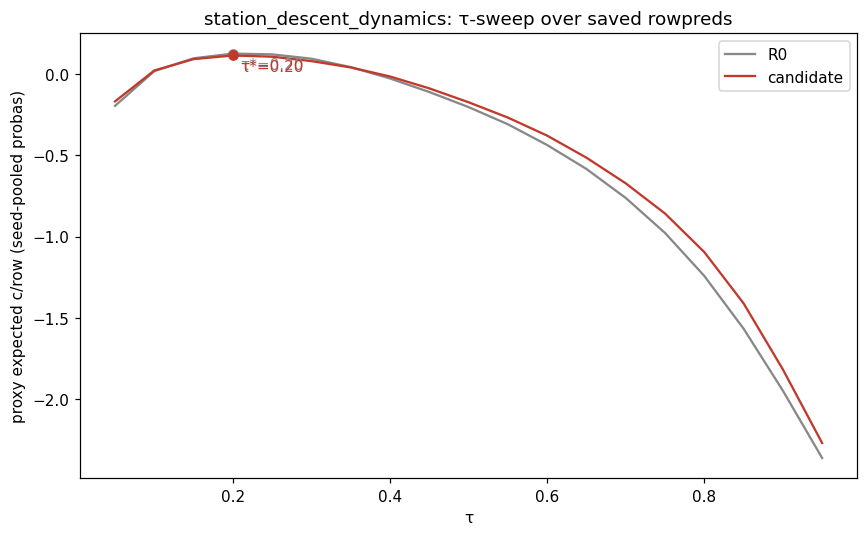
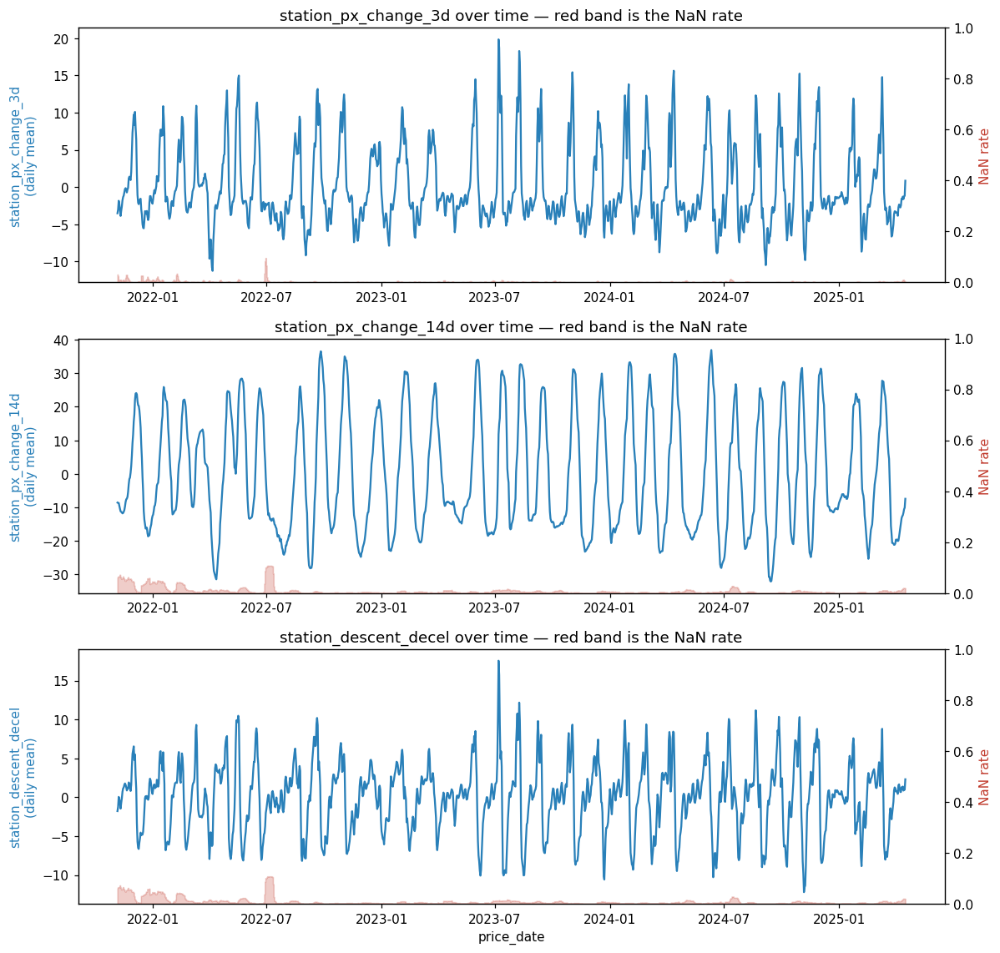
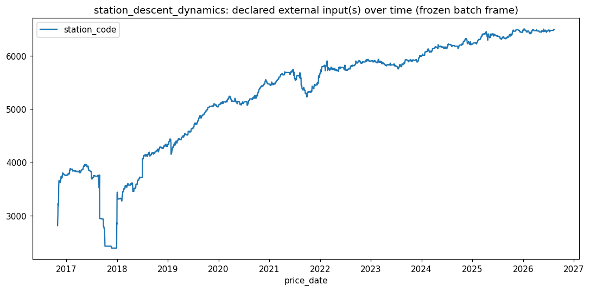

# batch1 / station_descent_dynamics

- **Date:** 2026-08-15 (snapshot) / dossiered 2026-08-25 / regime labels corrected 2026-08-30 (`fps-hnp`)
- **Branch:** main
- **SHA:** f536e98b9c183e754620d46ee0a6ef13681e7c35
- **Status:** done — **inconclusive**
- **Bead:** fps-6to
- **Cadence:** `50/3.571/1d/10%` (batch1's canonical daily cadence)

## Hypothesis

The retail descent is a sequence of discrete cuts, and the SHAPE of a
station's own cut sequence says how much of the descent is left. A station
still cutting 1-2 c/day is mid-descent; a station whose recent pace has
collapsed toward zero while its 14-day pace was steep has arrived at its
floor and is now exposed to the restoration. The lock cannot express this:
every dynamic column in it is network-level (one value per date), so the
model sees the Sydney-average clock and each station's contemporaneous
LEVEL, but never the station's own rate of change.
`station_minus_last_min_cents` is the closest substitute and is a distance
to a NETWORK trough, not a station velocity. Columns:
`station_px_change_3d`, `station_px_change_14d`, `station_descent_decel`.

**Predicted signature:** decision-timing, not accuracy — the model should
stop waiting earlier on rows where `station_descent_decel` has gone positive
(recent pace slower than the trailing pace) at moderate `cycle_pct_through`,
and keep waiting longer where it's negative (cuts still accelerating). A
MODEST number of buy/wait flips, concentrated in elongated cycles where the
network clock and the station's own pace diverge most — i.e. the
shallow-vs-steep-within-elongated distinction #214's oracle diagnostic found
invisible in `network_px_std` until phase > 1.4. The per-fold contribution
should be largest in folds 3 and 7 (the elongation-axis folds) and
near-zero elsewhere; a uniform improvement across all 14 folds would instead
mean the columns are working as generic momentum, not a descent-shape read.

## How to invoke this script

```bash
PYTHONPATH=. uv run python -m experiments.pipeline.runner \
  --batch-dir experiments/batches/batch1 \
  --candidate experiments/candidates/batch1/station_descent_dynamics.py
```

## Facts

Transcribed from `facts.json` — no new arithmetic.

**Provenance:** batch `batch1`, snapshot 2026-08-15, seeds [42, 43, 44, 45,
46], wall 1079.2s, status `graded`, 54-column baseline (`54:1a6ec2d84a69`).

**Headline (realised CPL, held τ — the arbiter):**

| | R0 | candidate | delta |
|---|---|---|---|
| CPL held | 187.8211 | 187.7940 | **-0.0272** |

`effect_resolved`: **true**.

**WFCV log-loss** (descriptive colour, NOT the arbiter): Δll_all mean
-0.00057, Δll_hard25 mean -0.02066. Both nominally favour the candidate.

**Zone (target = folds 3/7, the candidate's own declared elongation axis):**

| | target (folds 3, 7) | other |
|---|---|---|
| delta_cpl_own | +0.0138 | -0.0345 |
| n_fills | 431 | 1906 |

`resolved`: **false** — the target zone shows a small WORSENING, not the
predicted improvement; the improvement instead sits in the "other" fills.

**Per-fold** (regime column reflects the corrected empirical shock-fold set
`{1, 3, 4, 14}`, not the fixed `{1, 4, 9, 13}` this dossier originally used
— folds 3 and 9 swap regime labels, as do 13 and 14 — see the Correction
note below the Judgement section; this candidate's TARGET grades on folds
3/7, not regime, so `resolved` above is unaffected, but the descriptive
per-regime split below is not):

| fold | regime | n_fills | delta_cpl_own |
|---|---|---|---|
| 1 | shock | 169 | -0.2459 |
| 2 | normal | 200 | +0.3586 |
| 3 | shock | 191 | -0.1517 |
| 4 | shock | 239 | +0.3787 |
| 5 | normal | 179 | +0.4037 |
| 6 | normal | 130 | -0.0735 |
| 7 | normal | 231 | +0.1968 |
| 8 | normal | 88 | -0.1318 |
| 9 | normal | 112 | +0.1273 |
| 10 | normal | 95 | +0.2791 |
| 11 | normal | 161 | -0.5651 |
| 12 | normal | 185 | -0.2809 |
| 13 | normal | 146 | **-1.2787** |
| 14 | shock | 169 | +0.3727 |

No cell is suppressed (`min_row_cell_n` = 30, smallest cell here is 88).

**Per-regime:** shock **+0.0703** c/L (n=785), normal **-0.0720** c/L
(n=1543) — **the sign of both cells flips relative to the old fixed shock
set** (was shock -0.2837, normal +0.0706), because fold 13 (this run's
single largest favourable cell, -1.28 c/L) moves from shock to normal
under the correction. See the Correction note below.

`per_axis` is `null` — this candidate declared no `add_axis` beyond the
folds-3/7 zone check above, so there is no path-coupled per-row zone to
caveat here.

**Seed stability:** 2 cells exceed 5× the cohort-median seed_std, both on
run R0, `all` cohort — folds 2 (5.99×) and 3 (5.90×). Both are R0 (baseline)
flags, not candidate-arm flags.

**Validation:** PIT passed (differential PIT truncation test found no
leak). INPUTS check passed. Candidate column NaN rates:
`station_px_change_3d` 0.18%, `station_px_change_14d` 0.85%,
`station_descent_decel` 0.85%.

**Noise floor** (`experiments/batches/batch1/noise_floor.json`, 10 draws at
arity 3 — matches this candidate's 3-column arity, `floor_arity_exceeds_run`:
false): band mean +0.0251 c/L, band std 0.0999 c/L. The candidate's -0.0272
c/L sits at the **60th percentile** of the 10 observed noise draws
(`candidate_percentile_better_than_noise` = 60.0), and the parametric
single-candidate call is `z = -0.523` against a threshold of `t = 1.923`:
well inside the band.

**Decision flips** (`facts["decision_flips"]`, diffs R0's and the
candidate's `fills.parquet` directly on `(fold, station_code, date)`;
`flip_cpl_*` is `pooled_cpl` over ONLY the fills that differ in that fold,
not the same quantity as `delta_cpl_own` above, which pools every fill):
**439 total flips**. Per fold:

| fold | regime | n_baseline_only | n_candidate_only | flip_cpl_baseline | flip_cpl_candidate | flip_cpl_delta |
|---|---|---|---|---|---|---|
| 1 | shock | 21 | 0 | 166.83 | — (no candidate-only fills) | — |
| 2 | normal | 39 | 46 | 181.28 | 182.37 | +1.09 |
| 3 | shock | 14 | 23 | 205.56 | 200.98 | -4.57 |
| 4 | shock | 23 | 30 | 183.29 | 183.18 | -0.12 |
| 5 | normal | 32 | 26 | 188.61 | 189.24 | +0.63 |
| 6 | normal | 17 | 12 | 187.36 | 186.34 | -1.02 |
| 7 | normal | 16 | 12 | 178.31 | 177.15 | -1.16 |
| 8 | normal | 6 | 9 | 183.85 | 182.31 | -1.54 |
| 9 | normal | 6 | 6 | 198.55 | 195.06 | -3.48 |
| 10 | normal | 20 | 19 | 205.93 | 204.78 | -1.15 |
| 11 | normal | 4 | 5 | 212.03 | 197.57 | **-14.46** |
| 12 | normal | 5 | 9 | 188.75 | 181.79 | **-6.96** |
| 13 | normal | 8 | 18 | 199.81 | 186.16 | **-13.65** |
| 14 | shock | 6 | 7 | 180.73 | 184.55 | +3.82 |

Fold 1's `flip_cpl_delta` is unavailable (`null`): R0 has 21 baseline-only
fills there and the candidate has zero candidate-only fills to compare
against, so `flip_cpl_candidate` is 0/0. The shape is **deferral, not
reduced buying**: total litres are identical (1539.286 L in both arms —
consumption is fixed, so the arms always buy the same fuel), and the
candidate's fill *dates* are a strict subset of R0's. Reconstructing tank
level day by day, the candidate is never AHEAD of R0 on cumulative litres
in this fold (behind on 14 days, level on 76) — it runs a leaner tank, buys
later, and because its later buys are large it never needs R0's string of
3.571 L top-ups (exactly one day's consumption at this cadence — the
"wait" outcome). Fill-level: 153 byte-identical, 16 same-date-different-
volume, 21 R0-only dates, 0 candidate-only. Example, station 18517:
R0 takes 46.4 L @165.9 on 2021-11-17; the candidate takes 21.4 L that day
and 28.6 L on 11-18 @**155.9** — same fuel, one day later, 10 c/L cheaper.

Note fold 13 is the mirror image (candidate ahead on 41 days, level on 44,
behind on 5): the same three columns produce opposite timing bias in the
two folds, which is consistent with them reading descent SHAPE rather than
carrying a fixed buy-earlier or buy-later tilt.

**Instrument caveat:** `decision_flips` keys on `(fold, station_code,
date)`, so a fill that occurs on the same day in both arms at a DIFFERENT
volume is counted as common, not as a flip. Across this run that hides 150
volume-only changes behind the 439 counted date-flips — fold 12 is the
sharpest case (13 volume-only changes against only 14 date-flips), and
fold 1's null is entirely an artifact of this blind spot. Tracked as
`fps-gzz`.








## Post-hoc analysis (2026-08-25, NOT pipeline-generated)

Added while reviewing this dossier, to separate two readings the graded run
cannot tell apart: are the columns inert, or is the edge real but too small
and too fat-tailed for 14 folds to resolve? Script and output:
`posthoc_decel_conditional.py` / `.log`. No new data, no refit — a
conditional-distribution read of this run's own `rowpreds.parquet`, across
all **714 stations / 770,799 rows**, far wider than the 5 preferred
stations the backtest fills cover. Forward 3-day change is recovered from
the backward change observed three days later.

Base rate: mean forward-3d **-0.06 c/L**, P(cliff > +25 c/L) **5.37%**.

Within steep descents (`station_px_change_14d <= -15`), by
`station_descent_decel`:

| decel | n | mean fwd 3d | edge vs base | P(cliff >+25c) | label |
|---|---|---|---|---|---|
| [-99, 0) cuts still accelerating | 79,082 | -2.41 | -2.35 | **2.22%** | 0.203 |
| [0, +2) | 41,747 | -1.10 | -1.03 | 4.25% | 0.292 |
| [+2, +4) | 51,164 | +0.45 | +0.52 | 6.82% | 0.352 |
| **[+4, +6)** (both decisive fold-13 buys) | 32,010 | +0.61 | **+0.67** | 6.62% | 0.411 |
| [+6, +8) | 10,052 | +0.29 | +0.35 | 5.41% | 0.442 |
| [+8, +99) | 2,157 | -0.13 | -0.07 | 3.71% | 0.503 |

**The columns carry real information.** A station whose cuts are still
accelerating is **3x safer to wait on** (2.22% cliff risk) than one whose
descent has stalled (6.6-6.8%) — the direction the hypothesis predicted,
on a sample far too large to be noise.

**But the edge per opportunity is ~0.67 c/L**, and the payoff is
fat-tailed: in the [+4,+6) cell you gain roughly nothing ~93% of the time
and dodge a 25-45 c/L step ~7% of the time.

**Fold 13 sampled that tail twice** — 18517 on 2024-10-20 (decel +4.93,
174.9 -> 207.9 overnight, pinned 17 days) and 585 on 2024-11-20 (decel
+5.36, 172.9 -> 207.9, pinned 9 days). A second multiplier then stacked on
top: R0's tank ran dry inside both plateaus, so it did not merely pay more
later, it was FORCED to buy — 964 L (56% of the fold's litres) at 195.57
c/L against 176.14 voluntary, a 19.4 c/L forced-fill premium. Fold 13's
-1.28 c/L is a real edge's lucky realisation, not a repeatable magnitude.

Caveats: forward return is not realised saving — it ignores the tank
mechanics, so +0.67 c/L is a LOWER bound on what acting on the signal is
worth, and is silent on whether the MODEL can capture it. The buckets are
also not clean everywhere: unconditioned on `px_change_14d`, high decel
mixes "deep descent stalled" with "just restored" (a +34/+16 post-jump row
scores decel +30.6), which is why the table conditions on steep descents
first.

## Judgement

**Signature grading: contradicted.** The candidate made a specific,
falsifiable prediction — concentration in folds 3 and 7, near-zero
elsewhere, with a MODEST flip count — and the pipeline's own instruments
say the opposite on every count. The zone test built from the candidate's
own declared target (folds 3, 7) reads `resolved: false`: those folds show
a small worsening (+0.0138 c/L) while the rest of the run carries the
improvement (-0.0345 c/L). Folds 3 and 7 individually are unremarkable
(-0.15 and +0.20 c/L) next to fold 13's -1.28 c/L or fold 11's -0.57 c/L —
neither of which the candidate predicted. The flip count (439, tens per
fold across all 14) is large and diffuse, not the "modest, concentrated"
shape predicted. **Corrected 2026-08-30 (`fps-hnp`):** what aggregate
improvement exists now traces mostly to **normal**-regime folds
(per-regime: shock +0.0703 vs normal -0.0720 c/L, against the corrected
empirical shock-fold set `{1, 3, 4, 14}`) — the reverse of the original
2026-08-25 reading below, which (against the old fixed set `{1, 4, 9, 13}`)
attributed the improvement to shock-regime folds instead. Fold 13, the
single largest favourable cell, is the reason: it was `shock` under the
old set and is `normal` under the corrected one. Read literally, this is
now closer to — not further from — the candidate's own framing (elongated
*normal*-regime descents), though the candidate's declared axis was
elongation (folds 3/7) specifically, not the regime label, and the zone
test above still reads `resolved: false` against that declared axis
regardless of this regime reattribution.

None of this reaches the arbiter, though: the headline -0.0272 c/L sits
well inside this batch's own noise band (z=-0.52 vs threshold 1.92, 60th
percentile of the noise draws) — this run cannot distinguish the candidate
from noise at all, regardless of the mechanism question above.

**not_tested:**

- **Whether an evaluation that can SEE a fat-tailed payoff would resolve
  these columns.** Superseded the old "is there a shock-regime mechanism"
  item: the post-hoc analysis above shows there is one, and names it —
  stalled-descent rows carry 3x the cliff risk of still-cutting rows. What
  remains untested is whether pooled realised CPL over 14 folds can ever
  resolve an edge of ~0.67 c/L whose payoff arrives in ~7% of firings.
  Candidate designs: many more folds; scoring on tail-avoidance (frequency
  of buying within N days of a >25 c/L step) rather than pooled CPL; or
  block-bootstrap CIs on the per-fold deltas instead of a single pooled
  headline. Note the graded run's own instruments were not wrong — the
  noise-band verdict is correct — the question is whether the arbiter has
  the resolution for this shape of effect at all.
- **Whether the effect is real but underpowered**, not absent. The
  headline sits inside the noise band, which per the ledger's own header is
  not the same as rejection — more data, or a different arm reading the
  same station-level cut sequence, is legitimate open ground.
- **Whether fold 1's deferral shape is mechanism or incident.** The
  candidate's fill dates are a strict subset of R0's there and it is never
  ahead on cumulative litres — is that informative about what
  `station_descent_decel` reads on a shock fold's early cuts, or a
  coincidence of that fold's price path? Not tested.
- **Per-column attribution** (which of the three columns is doing
  anything, vs. inert or reinforcing) needs SHAP interaction values on the
  fitted candidate model, which the pipeline doesn't currently persist —
  same gap noted on `network_move_breadth`.

**Recommendation:** not a graduation candidate on this run, and the
specific mechanism predicted (elongated-fold concentration) is
contradicted by the pipeline's own zone test — but the headline itself is
inside the noise band, so this is inconclusive rather than a rejection of
the underlying columns.

The post-hoc analysis sharpens what to do next. The columns are **not
inert** — `station_descent_decel` separates cliff risk 2.22% vs 6.6-6.8%
within steep descents, in the predicted direction, on 200k+ rows. The
problem is resolution, not existence: an edge of ~0.67 c/L per firing,
realised in ~7% of firings, is not something a 14-fold pooled-CPL arbiter
can distinguish from noise. So if this series is revisited, the change
should be to the EVALUATION before the hypothesis — give the run an
instrument that can see a fat-tailed payoff — rather than re-targeting the
columns at a shock-restoration story and scoring it the same way.

## Followups

- None filed — the per-column-attribution gap (SHAP, needs the candidate
  model persisted) is a repeat of the same open item noted on
  `network_move_breadth`; not worth a second bead for the same ask.

## Correction note — 2026-08-30 (`fps-hnp`, backfill of PR #350 / `fps-3tu`)

PR #350 replaced the batch's fixed shock-fold index (`SHOCK_FOLDS =
{1, 4, 9, 13}`) with a per-batch empirical set derived from the baseline's
own val-fold log-loss. batch1's corrected set is **`{1, 3, 4, 14}`**
(`experiments/batches/batch1/shock_folds.json`) — folds 3 and 9 swap
regime labels, as do 13 and 14, relative to the old fixed set. **This
candidate's TARGET grades on folds 3/7 directly, not on the regime axis,
so the zone `resolved: false` verdict is entirely unaffected.** What does
change is the descriptive per-regime breakdown used as colour in the
Facts and Judgement sections: fold 13 (this run's single largest
favourable cell) moves from shock to normal, which **flips the sign of
both per-regime cells** (shock -0.2837/normal +0.0706 →
shock +0.0703/normal -0.0720) and reverses which regime the Judgement
section credits with the aggregate improvement — both sections above have
been rewritten in place. This backfill reused the run's already-persisted
`fills.parquet` and `rowpreds.parquet`; no re-run of the realised backtest
was needed.

## Addendum — 2026-08-26: batch-wide coverage caveat

Found while reviewing `lga_trough_propagation`; it applies identically here, because
every batch1 candidate replays the same station-day grid. **Not specific to this
candidate, and it does not change this dossier's verdict.**

This run's `results.json` `meta` records `extra_feature_provider_hits` 5693 /
`extra_feature_provider_misses` 607 — the same split as both sibling candidates. The
6300 total is 5 preferred stations × 14 folds × 90 days. All 607 misses are
station-days where a Blue Mountains station has no feature row, and they are confined
to **folds 1-8**; folds 9-14 are completely clean:

| fold | window | missing | which |
|---|---|---|---|
| 1 | 2021-11-05..2022-02-02 (shock) | **180/450** | 414 and 18517, all 90 days |
| 2 | 2022-02-03..2022-05-03 | 8 | 414, 18517 |
| 4-8 | 2022-08-02..2023-10-25 | 67/90/90/90/82 | 414 |

Verified against `data/cleaned/` raw prices: the 2021 gap is **not** a closure — both
stations kept reporting through it (414: 44 raw rows inside, 18517: 75), at roughly a
third of their prior update rate, which trips `fill.py`'s 28-day fill cap and then
`labels.py`'s 7-before/90-after strip. 414's 2022-23 gap **is** a real year-long
rebuild, but it reopened ~2023-07 while the frame stays dark to 2023-10-17, so fold 8's
82 missing days are label-strip tail on a live, trading station.

So folds 1-8 ran on a smaller — and council-skewed — universe than folds 9-14. Fold 1
drops from 5 stations to 3, flipping the mix from 3 Blue Mountains / 2 Penrith to 1/2,
which matters wherever a fold-level read is being compared across the run. This is
reduced sample, **not corrupted sample**: a missing feature row means no fill was
available and both arms skip it identically.

Full analysis, including the per-fold decomposition and the `fps-ghr` implications:
`experiments/candidates/batch1/lga_trough_propagation/README.md` § Review addendum.
