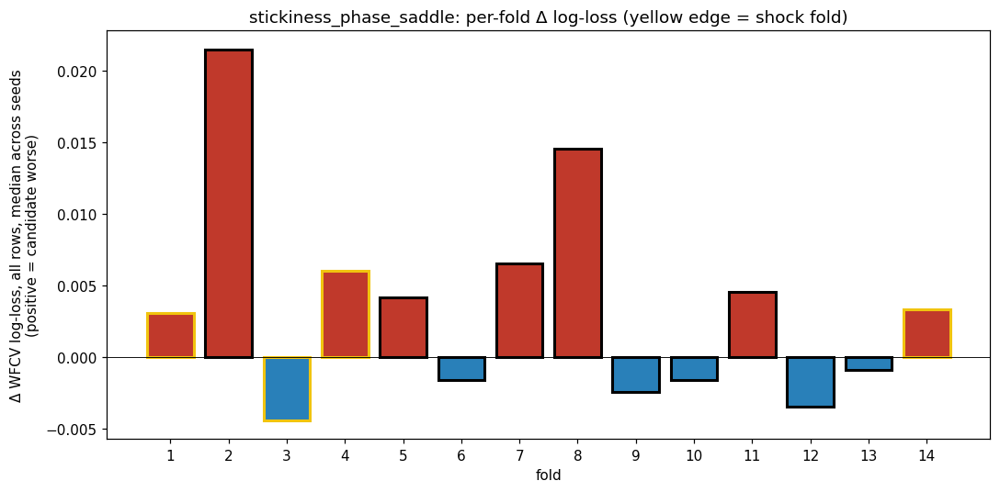
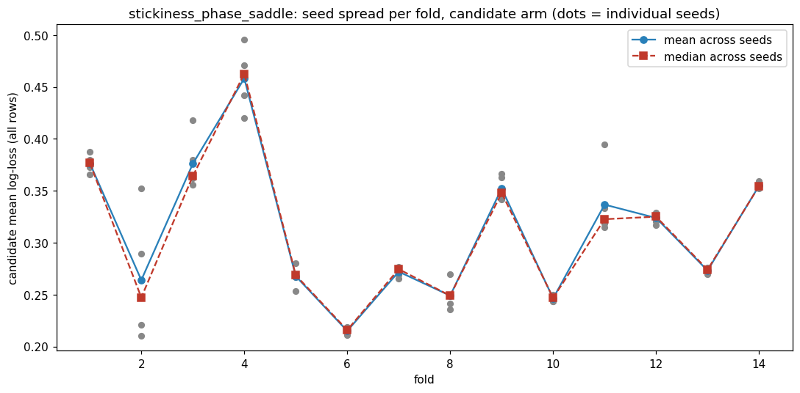
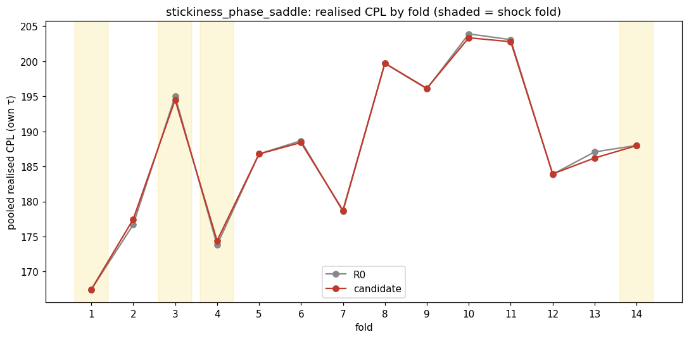
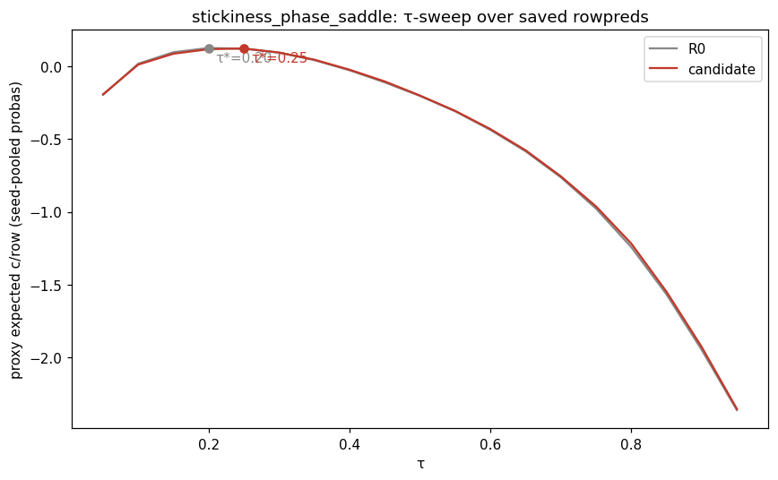
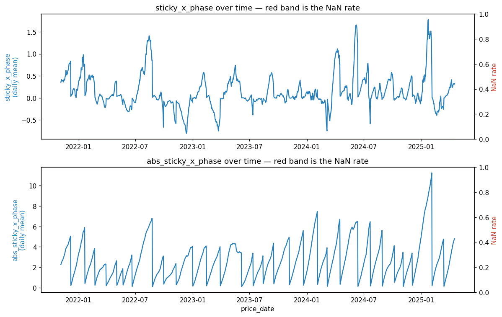
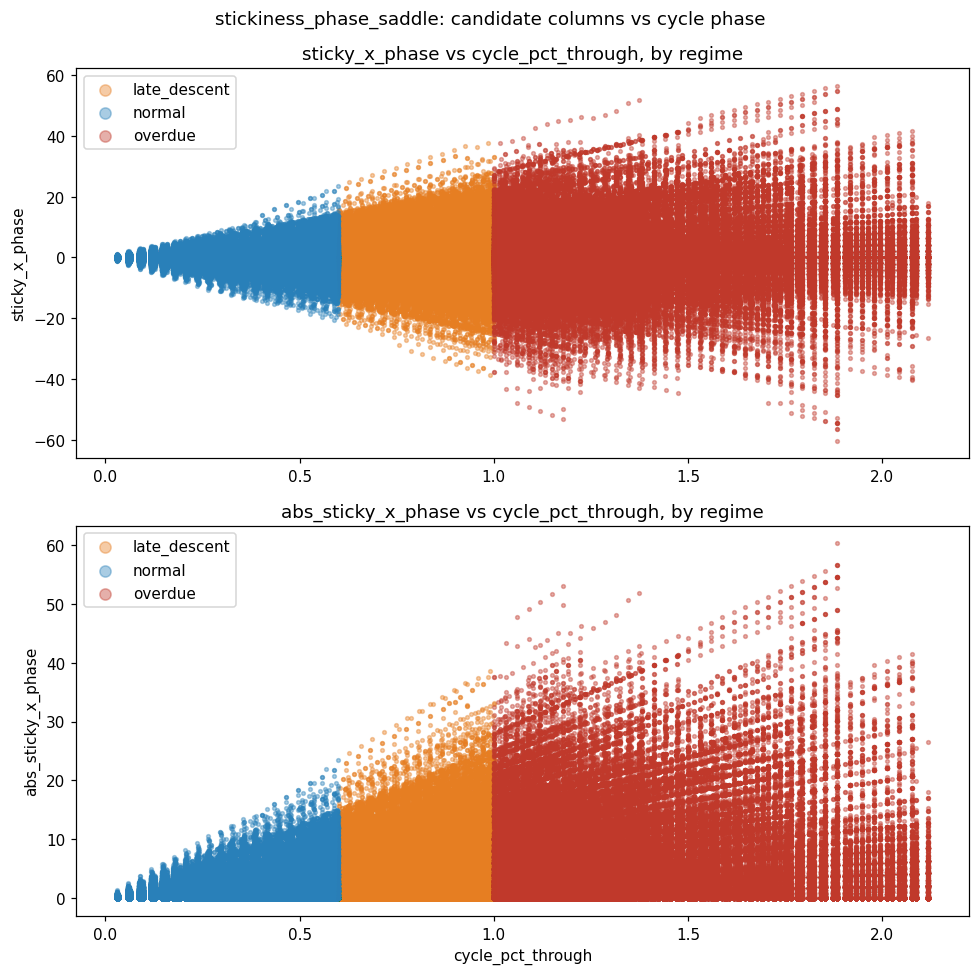

# batch1 / stickiness_phase_saddle

- **Date:** 2026-08-15 (snapshot) / dossiered 2026-08-27 / regime labels corrected
  2026-08-30 (`fps-hnp`) / flip table re-rendered 2026-08-31 (`fps-j6w`) / realised
  figures refreshed to the post-#359 regen 2026-09-03 (`fps-3ug`)
- **Branch:** main
- **SHA:** 12dc7629f1f440bbf71fa7f50304e6adb781d048 (the #359 regen run; the original
  2026-08-26 run was 9362d46d74f63ccc2a430e96379dfd8658f2036d — the model fits are
  byte-identical between the two, only the realised backtest was re-run)
- **Status:** done — **inconclusive**
- **Bead:** fps-6yi
- **Cadence:** `50/3.571/1d/10%` (batch1's canonical daily cadence)

## Hypothesis

`cycle_pct_through` is a NETWORK clock (one value per date), but a station's
willingness to follow that clock is a per-station property. A chronically
cheap, competitive station tracks the cycle closely: at phase 0.9 it really
is near its own trough. A chronically dear or erratic station is only
loosely coupled to it — the same phase reading carries much less
information about where that station's own price is going next. The lock
hands the model `stickiness_score` and `cycle_pct_through` separately and
nothing else; a gradient-boosted tree can only approximate their product
through nested axis-aligned splits. Columns: `sticky_x_phase`,
`abs_sticky_x_phase`.

**Predicted signature:** decision-timing — for stations with near-zero
stickiness the decisions should be essentially unchanged (the product is
~0 there), and the flips should concentrate on the tails of the
stickiness distribution, buying EARLIER on high-`|stickiness|` stations at
late phase. The distinctive signature is that the SIGNED and ABSOLUTE
columns are both used and DISAGREE in orientation somewhere in the SHAP
surface — if only `abs_sticky_x_phase` is used, the real content is
"outlier stations are decoupled," a weaker and different claim. Expected
to spread across folds rather than concentrate, since station composition
is cross-sectional with no particular fold affinity.

## How to invoke this script

```bash
PYTHONPATH=. uv run python -m experiments.pipeline.runner \
  --batch-dir experiments/batches/batch1 \
  --candidate experiments/candidates/batch1/stickiness_phase_saddle.py
```

## Facts

Transcribed from `facts.json` — no new arithmetic.

**Provenance:** batch `batch1`, snapshot 2026-08-15, seeds [42, 43, 44, 45,
46], wall 1037.8s, status `graded`, 54-column baseline (`54:1a6ec2d84a69`).

**Headline (realised CPL, held τ — the arbiter):**

| | R0 | candidate | delta |
|---|---|---|---|
| CPL held | 188.0376 | 187.9615 | **-0.0761** |

`effect_resolved`: **true**. Note the seeds above are the WFCV screen
only — the realised arbiter ran on a single seed
(`results.json` `meta.realised_seed` = 42). That is provenance, not a
missing error bar: the realised delta is a PAIRED difference in which
both arms share the seed, the data, the folds and the 54 baseline
columns, differing only by this candidate's 2 added columns, so the
fit's seed idiosyncrasy is common-mode and cancels. Its error bar is the
noise floor reported below, built the same paired way at the same fixed
seed (`PLACEBO_SEED_DEFAULT = SEEDS[0]` = 42) — that matching is what
makes the two comparable.

**WFCV log-loss** (descriptive colour, NOT the arbiter): Δll_all mean
+0.00355, Δll_hard25 mean -0.00651. Mixed — nominally slightly worse on
`all`, slightly better on `hard25`.

**Zone:** `resolved`: **null** — `TARGET` declared neither `folds` nor
`axis`/`expect_concentration_in`, so there is no declared-zone test to
report for this candidate (unlike `station_descent_dynamics` or
`lga_trough_propagation` in the same batch).

**Per-fold** (regime column reflects the corrected empirical shock-fold set
`{1, 3, 4, 14}`, not the fixed `{1, 4, 9, 13}` this dossier originally used
— folds 3 and 9 swap regime labels, as do 13 and 14 — see the Correction
note near the end of this dossier; this candidate declared no zone TARGET
at all, so nothing here is graded on regime, but the descriptive per-regime
split below is not):

| fold | regime | n_fills | delta_cpl_own |
|---|---|---|---|
| 1 | shock | 190 | 0.0000 |
| 2 | normal | 200 | +0.7729 |
| 3 | shock | 186 | -0.5079 |
| 4 | shock | 226 | +0.5364 |
| 5 | normal | 144 | -0.0130 |
| 6 | normal | 107 | -0.3302 |
| 7 | normal | 177 | +0.1796 |
| 8 | normal | 84 | +0.0190 |
| 9 | normal | 112 | +0.0718 |
| 10 | normal | 96 | -0.5536 |
| 11 | normal | 161 | -0.2953 |
| 12 | normal | 184 | +0.0528 |
| 13 | normal | 142 | **-0.8646** |
| 14 | shock | 169 | -0.0302 |

No cell is suppressed (`min_row_cell_n` = 30, smallest cell here is 84).

**Per-regime:** shock **-0.0078** c/L (n=776), normal **-0.1114** c/L
(n=1424). The reading is that **shock is flat and normal carries whatever
there is** — fold 13 (this run's single largest favourable cell) sits in
normal under the corrected shock-fold set, having sat in shock under the old
fixed one. The shock cell's *sign* is not a fact about this run: it has been
-0.0614 (old fixed set), +0.0047 (corrected set, pre-#359) and -0.0078
(corrected set, post-#359), all of them an order of magnitude below the
normal cell and well inside a band whose std is 0.0999. **A previous version
of this line read the pre-#359 +0.0047 as "the two regimes disagree in sign",
which the regen has already undone; a negligible cell has no readable sign,
and neither reading should be leaned on.** The candidate declared no zone
TARGET, so nothing is graded on this axis either way.

`per_axis` is `null` — this candidate declared no `add_axis` beyond the
(unresolved) zone check above.

**Seed stability:** 3 cells exceed 5× the cohort-median seed_std, all
`all`-cohort:

| fold | run | seed_std | ratio vs cohort median |
|---|---|---|---|
| 2 | R0 | 0.04577 | 5.56× |
| 2 | candidate | 0.07379 | 8.96× |
| 3 | R0 | 0.04510 | 5.47× |

Fold 2's flag is on the **candidate arm**, so per dossier convention here
is the fold × arm comparison rather than prose: R0's seed_std jumps from
0.04577 to 0.07379 on the candidate arm in the same fold — a ~1.6×
increase, consistent with the added columns mildly destabilising an
otherwise-ordinary fit in that fold. Raw seed_std against the quantity
that actually matters (`delta_ll_*`, not the CPL delta, which is not
seed-measured at all): candidate seed_std 0.07379 vs fold 2's
`delta_ll_all_median` +0.02152 (~3.4×) and vs `delta_ll_hard25_median`
-0.05522 (~1.3×) — a real but not extreme gap, nothing like the 1700×
case seen elsewhere in this project. Fold 3's flag is R0-only (a property
of that window, not the candidate) — one line is enough for it.

**Validation:** PIT passed (reached WFCV/realised stages, so the
differential PIT truncation test found no leak). INPUTS check passed.
Candidate column NaN rates: `sticky_x_phase` 0.0%, `abs_sticky_x_phase`
0.0%.

**Noise floor** (`experiments/batches/batch1/noise_floor.json`, 10 draws
at arity 3 — this candidate is only arity 2, so `floor_arity_exceeds_run`:
**true**, meaning this run was graded against a ruler built from MORE
columns than it has; allowed, since a wider ruler only raises the bar,
never lowers it, but it means a candidate that failed here has not been
shown to fail against its own arity's band): band mean +0.0251 c/L, band
std 0.0999 c/L. The candidate's -0.0761 c/L held-τ sits at the **80th
percentile** of the 10 observed noise draws
(`candidate_percentile_better_than_noise` = 80.0), and the parametric
single-candidate call is `z = -1.013` against `t = 1.923`
(`single_candidate_z_threshold`, the authoritative threshold — not the
nominal one) — inside the band on both sides
(`abs(z) < t`), so this is a two-sided pass into "inconclusive," not a
clean win.

Bar decomposition, in c/L: `single_candidate_bar_cpl_held` -0.1670 (the
threshold in project units); of that, `bar_draw_count_shift_cpl_held`
-0.0278 is the thinness penalty (10 draws vs the large-sample limit) and
`bar_reuse_shift_cpl_held` is **0.0** — this bank's draws carry no source-column-reuse discount at this candidate's arity. `floor_arity_excess`
is **1** (floor built at arity 3, run at arity 2).

**Decision flips** (`facts["decision_flips"]`, diffs R0's and the
candidate's `fills.parquet` directly on `(fold, station_code, date)` — not a
`rowpreds` proba-threshold crossing): run-level **247 flips / 77
decisions**, present in every fold except fold 1. `flips` overstates
independent evidence — one real flip cascades into a run of later differing
fills at the same station as the tank's state diverges, which `decns`
collapses over this run's own `cascade_window_days` = 7. **Read `decns`, not
`flips`, as this table's sample size**, and note it is not comparable across
runs at different cadences.

**This table is the render the post-dossier review addendum below asked
for** (§5, "the per-fold flip table cannot be read as written"). Every field
it specified was already in `facts.json`; only the rendering was stale, and
this section was re-rendered on 2026-08-31 (`fps-j6w`) with no new
computation.

Timing is rendered as **regret** (`decision_flips["regret"]`,
`horizon_days` = 13, `cadence_days` = **1**): `price paid − the cheapest
price that same station reached inside the tank's feasible wait`, so `0` is
the attainable optimum and lower is better. Unlike the flip-CPL columns it
is defined identically on both arms and cycle-normalised, so it pools. The
horizon is a fixed ceiling no real fill attains, making regret levels
conservative by construction; regret is comparable only WITHIN one cadence.
`flip_cpl_delta` is retained in `facts.json` but **no longer rendered**
(`fps-2js`) — `flip_cpl_baseline` and `flip_cpl_candidate` pool disjoint
fills on different days at different points in the price cycle, so their
difference has no stable denominator.

| fold | regime | flips | decns | litres R0 | litres cand | regret R0 | regret cand | regret Δ | Δ interval (2·SE) | run_contribution_cpl |
|---|---|---|---|---|---|---|---|---|---|---|
| 1 | shock | 0 | 0 | 0.0 | 0.0 | — | — | — (`no flips`) | — | +0.0000 |
| 2 | normal | 50 | 13 | 200.0 | 425.0 | 7.80 | 10.48 | +2.68 | [-7.44, +12.80] | +0.0585 |
| 3 | shock | 37 | 10 | 396.4 | 360.7 | 6.55 | 4.97 | -1.58 | [-7.72, +4.56] | -0.0396 |
| 4 | shock | 34 | 13 | 207.1 | 353.6 | 16.63 | 18.30 | +1.66 | [-8.48, +11.81] | +0.0354 |
| 5 | normal | 16 | 6 | 114.3 | 207.1 | 12.40 | 13.94 | +1.54 | [-4.04, +7.12] | -0.0008 |
| 6 | normal | 12 | 4 | 92.9 | 57.1 | 10.16 | 14.25 | +4.09 | [-6.07, +14.25] | -0.0199 |
| 7 | normal | 6 | 4 | 28.6 | 110.7 | 16.75 | 17.92 | +1.17 | [-4.38, +6.72] | +0.0109 |
| 8 | normal | 36 | 5 | 382.1 | 378.6 | 8.93 | 9.26 | +0.34 | [-10.45, +11.12] | +0.0015 |
| 9 | normal | 3 | 2 | 0.0 | 78.6 | — | 5.20 | — (`one arm only`) | — | +0.0056 |
| 10 | normal | 30 | 6 | 214.3 | 389.3 | 13.58 | 8.01 | -5.57 | [-18.39, +7.25] | -0.0396 |
| 11 | normal | 7 | 3 | 35.7 | 89.3 | 32.00 | 16.84 | -15.16 | [-37.19, +6.87] | -0.0206 |
| 12 | normal | 5 | 5 | 100.0 | 75.0 | 22.57 | 12.54 | -10.03 | [-24.20, +4.15] | +0.0040 |
| 13 | normal | 6 | 3 | 53.6 | 42.9 | 5.73 | 0.00 | -5.73 | [-41.77, +30.31] | -0.0675 |
| 14 | shock | 5 | 3 | 32.1 | 50.0 | 7.00 | 1.99 | -5.01 | [-13.10, +3.07] | -0.0023 |
| **all** | — | **247** | **77** | **1857.1** | **2617.9** | **11.14** | **10.69** | **-0.46** | **[-4.83, +3.92]** | **-0.0746** |

**Every resolvable regret delta sits inside its own 2·SE interval — 12 of
12, plus the pooled `all` row.** Per `docs/routines/dossier.md`, an
`inside_own_se` cell must never be cited as evidence in the Judgement
section, so **no cell in this table may be cited, and no vote count over
them is admissible.** The superseded rendering of this section claimed
"favourable flips dominate — 9 of the 12 folds with a computable delta";
that sentence is removed, and the addendum below (§5) explains why it was
the wrong kind of statement. Fold 13's much-quoted -32.73 c/L flip delta is
the clearest case: on regret it reads **-5.73 against `[-41.77, +30.31]`**,
the widest interval in the run, on **3 decisions**.

Two cells are not resolvable at all and their reasons are stated verbatim
rather than blanked: fold 1 is `no flips` (both arms identical that fold),
fold 9 is `one arm only` (3 candidate-only fills, zero baseline-only).
Neither is the same as a resolved zero.

The pooled row is the only run-level statement this table can make: **both
arms buy about equally well relative to what they could have reached**
(11.14 vs 10.69 c/L of regret, Δ -0.46 against a ±4.37 interval), consistent
with a -0.0761 c/L headline — the same conclusion the addendum reached by
its own route.

**Litres:** flip-only volume is 1857.1 L on R0 against 2617.9 L on the
candidate — a **41% gap**, still the largest in batch1, on a spend-weighted
metric. The two arms are not diverging on equal volume, which is why a flip
COUNT and a flip CPL answer different questions. **Dark fills:**
`dark_fill_days` = **0** of 247 scored. Pre-#359 this run recorded **56**
dark fills in folds **4–7** (the Blue Mountains preferred-station outage),
scored at the forward-filled price the tank simulator had bought at.
`fps-2i4`/#356 stopped the realised backtest transacting at a station's stale
frozen price through a closure, so those station-days are no longer bought at
all. Folds 4–7 are exactly the folds whose cells moved in the regen, and only
those.

**`run_contribution_cpl`** is what each fold's divergence is worth at the
scale of the whole run — a litres-weighted shift-share of that fold's own
`delta_cpl_own` (the whole fold, matching and flipped fills alike), not of
the flip-only figures. It reconciles: `run_contribution_total_cpl`
**-0.0746** + `composition_residual_cpl` **-0.0015** = **-0.0761**, the
headline `delta_cpl_held`. (The addendum below quotes the pre-#359
reconciliation, -0.0606 + -0.0129 = -0.0735; the residual has shrunk to
almost nothing, which is the smallest in batch1 either way.)
This run's `tau_diverges_any` is `None` (**unavailable, never read as
"checked, agrees"**), so the residual is composition drift **and possibly
tau drift**.

Summed by regime: **normal -0.0680** (10 folds, 51 decns) against **shock
-0.0066** (4 folds, 26 decns). `n_flips` spread across 13 of 14 folds is
consistent with the predicted "spread across folds, not concentrated"
shape, but `decision_flips` carries no station-level stickiness data, so it
cannot confirm the more specific "flips concentrate on the
stickiness-distribution tails" claim.








## Judgement

**Signature grading: inconclusive.** Two separate things carry that label
and they should not be confused. The ledger `outcome` is mechanical
(`docs/routines/dossier.md` step 3: `-t < z < t` -> `inconclusive`), and
z=-1.01 against t=1.92 puts this run inside the band — that field is
correct and stays. Separately, the candidate's own `PREDICTED_SIGNATURE`
was written in terms of SHAP importance/orientation, which
`docs/routines/dossier.md` (decided `fps-1l1`) grades `inconclusive`
**always**, because no SHAP field will ever exist in `facts.json`. So the
signature grade here is a property of how the claim was phrased, not a
measurement of the claim.

What the run itself showed: realised delta -0.0761 c/L in the favourable
direction, 247 decision flips across 13 of 14 folds. Inside the noise band
on the ruler used. (On the per-regime split — descriptive only, since this
candidate declared no zone TARGET — the shock cell is negligible and has
changed sign twice across the shock-set correction and the #359 regen; see
the Facts section, which now declines to read a sign off it at all.)

**This dossier's original recommendation was wrong and has been replaced**
— see the post-dossier review addendum below. Both routes it named for a
"second look" were already closed at the time of writing, and the one
mechanism question it declared uncheckable was checkable from
`facts.json`'s own `decision_flips.rows`.

**not_tested:**

- ~~Whether the predicted SHAP signature exists.~~ **Permanently
  untestable, not pending.** `fps-1l1` closed 2026-08-27 down its
  "don't capture" branch: no SHAP field will exist in `facts.json`, and
  `docs/routines/dossier.md` now grades any SHAP-shaped signature
  `inconclusive` on sight. This is a defect in how the candidate's
  signature was *phrased*, not a gap in the pipeline — see `fps-3jj.10`
  lead 6 and `fps-i2o` below.
- ~~Whether a floor matching this candidate's own 2-column arity would
  move the call.~~ **Answered — it would not.** Already resolvable from
  banks committed in the batch directory (see addendum): z=-0.84 against
  the arity-1 bank, -0.90 against the ICC bank, -1.01 against the arity-3
  bank the run was graded on. No comparable ruler brings |z| near t=1.92.
- Whether flips concentrate on the tails of the **stickiness**
  distribution specifically. Still open — `decision_flips` carries no
  station-level stickiness data, so the mechanism was localised by market
  condition (cycle turns) rather than by station type. The stickiness-tail
  formulation of the claim remains unmeasured.
- **New, and the live one:** whether a turn-GATED construction pays.
  The mechanism is real but mispriced (addendum below); nothing here tests
  a version that is inert outside turn conditions. Filed as `fps-3jj.10`
  lead 6. The open sub-question is what a PIT-safe turn gate is built
  from — the addendum's turn definition is forward-looking and is a
  diagnostic, not a constructible feature.

**Recommendation:** reject **this construction**; graduate the
**mechanism** to a redesign lead. The effect size question is settled —
inside the band on three independently-built rulers, with no remaining
route to move it without a new run. The mechanism question is answered
well enough to act on: the interaction genuinely helps at cycle turns and
mildly hurts everywhere else, and turns are too small a share of volume
for that trade to pay. Do not re-run this candidate as written. The live
successor is `fps-3jj.10` lead 6 (turn-gated stickiness x phase).

## Addendum — post-dossier review (2026-08-29)

New arithmetic, deliberately kept out of the Facts section above (which
stays a transcription of `facts.json`). Sources: `facts.json`'s
`decision_flips.rows`, this run's `fills.parquet`, and
`experiments/batches/batch1/fuel_signal.db` daily prices. All of it was
available when the dossier was written.

**Provenance flag added 2026-09-03 (`fps-3ug`): every figure in this addendum
is measured on the PRE-#359 run.** Its `fills.parquet` input is gitignored and
the on-disk copy predates the regen, so none of §§2-5 can be restated exactly;
they are kept as measured. Where a figure is also in `facts.json` and has
moved, the current value is given inline below. None of the addendum's
conclusions changes: the mechanism localisation at cycle turns, the
"turn-adjacent volume is too small a share to pay" reading, the withdrawn §4
result, and §5's "0 of 12 folds resolve their own flip delta" all hold against
the post-#359 `facts.json` (§1's bank table is the one place where the
numbers themselves are refreshed, since those z values live in `facts.json`).

**1. The arity question was already answerable.** `_noise_band()` reads
`noise_floor.json` by fixed filename. Two further banks sit in the same
directory with matching `baseline_fingerprint` (`54:1a6ec2d84a69`), tank
params (`50/3.571/1d/10%`) and 14 windows:

| bank | draws | arity | null_method | band mean / std | candidate z |
|---|---|---|---|---|---|
| `noise_floor.json` (graded on) | 10 | 3 | `placebo_column` | +0.0251 / 0.0999 | **-1.01** |
| `noise_floor_k1.json` | 20 | 1 | `placebo_column` | -0.0089 / 0.0800 | **-0.84** |
| `noise_floor_icc.json` | 32 (eff. 14.7) | 1 | `placebo_column_pinned_source` | +0.0278 / 0.1152 | **-0.90** |

An arity-2 band sits between the arity-1 and arity-3 banks by
construction. None approaches t=1.92. Filed as `fps-30p`: make the dossier
consult every comparable bank rather than one.

**2. The mechanism is real, and located at cycle turns.** Taking each
flipped fill and looking forward at that station's own price (a
post-hoc diagnostic — forward data is the point, and would be a leak in a
feature):

- **Turn catches** (bought within 3 days of a >=15 c/L rise): candidate
  11, baseline 4 — spread across folds 2, 3, 8, 10 and 13, not one
  window. Not significant on its own (Fisher p=0.28-0.42).
- **Litres-weighted 7d regret** (price paid minus the cheapest price at
  that station in the next 7 days; 0 = bought the optimum):

  | flips | baseline | candidate |
  |---|---|---|
  | turn-adjacent (n=8 / 11) | 21.62 c/L | **0.33 c/L** |
  | ordinary (n=112 / 172) | 5.64 c/L | 6.52 c/L |
  | **all flips** | **6.22 c/L** | **6.21 c/L** |

**3. Why it does not pay.** Turn-adjacent fills are 150 of 2982 flipped
litres (~5%). The candidate buys near-optimally there and is 0.88 c/L
worse across the other 95%, so litres-weighted regret over all flips is a
dead heat — which is exactly why the realised delta is ~0. Fold 13's
much-quoted -32.73 c/L flip delta contributes **-0.0644 c/L** to the run;
folds 2 and 4 hand back **+0.0995** between them (litres-weighted
shift-share off `fills.parquet`, reconciling to the headline -0.0735 via
a -0.0129 composition residual). *Post-#359 the three `facts.json` figures
in that last sentence read -0.0675, +0.0939 and -0.0761 / -0.0015; the flip
delta itself (-32.73) and the ~5% litres share are pre-regen and unchanged
here. The argument — a near-optimal 5% against a slightly worse 95% — is
untouched.*

**4. Withdrawn during this review.** An apparent "the candidate never
buys before a sharp fall" result (0/183 vs the baseline's 4/120, Fisher
p=0.024) did **not** survive a threshold sweep — p=1.000 at 8-10 c/L,
0.202 at 12, 0.156 at 20, 0.396 at 25. An isolated island of significance
across 14 tests. Not evidence; recorded here so it is not rediscovered.

**5. The per-fold flip table cannot be read as written.** Against each
cell's own standard error (per-fill flip price dispersion 13.7 c/L,
litres-weighted effective n of 1.0-19.5 per arm), **0 of 12 folds print a
`flip_cpl_delta` larger than twice its own SE** — fold 13's -32.73 sits
inside a 2*SE of 36.77 (41.05 post-#359; still inside, and still 0 of 12).
The Facts section's "favourable flips dominate — 9 of the 12 folds" is a vote count over cells that cannot resolve their
own numbers, and should not be read as corroboration. A redesign of the
flip table (counts + cascade-collapsed decisions + litres + a
headline-reconciling contribution column + each delta beside its own
2*SE) is in hand but not yet filed.

**Power caveat on all of the above:** the turn cells are n=11 and n=8, the
two arms' flips fall on different days (two decision sets, not a paired
test), and 303 flips are ~87 independent decisions once cascades are
collapsed (247 and 77 post-#359 — a smaller sample making the same point). The effect-size conclusion is solid; the mechanism
localisation is suggestive and under-powered.

## Correction note — 2026-08-30 (`fps-hnp`, backfill of PR #350 / `fps-3tu`)

PR #350 replaced the batch's fixed shock-fold index (`SHOCK_FOLDS =
{1, 4, 9, 13}`) with a per-batch empirical set derived from the baseline's
own val-fold log-loss. batch1's corrected set is **`{1, 3, 4, 14}`**
(`experiments/batches/batch1/shock_folds.json`) — folds 3 and 9 swap
regime labels, as do 13 and 14, relative to the old fixed set. **This
candidate declared no zone `TARGET` at all** (`resolved: null`), so
nothing here was ever graded on the regime axis and the Recommendation is
entirely unaffected. What does change is the descriptive per-regime split
used as colour in the Facts and Judgement sections: fold 13 (this run's
single largest favourable cell) moves from shock to normal, which flips
the "both regimes favour the candidate" reading (shock -0.0614/normal
-0.0768 → shock +0.0047/normal -0.1034; all four figures pre-#359 — post-regen
the corrected-set pair is shock -0.0078/normal -0.1114, i.e. the negligible
shock cell has changed sign again, which is why the Facts section now declines
to read a sign off it) — both sections above have been rewritten in place. This backfill reused the run's already-persisted
`fills.parquet` and `rowpreds.parquet`; no re-run of the realised backtest
was needed.

## Addendum — batch-wide coverage caveat

This run's `results.json` `meta` records `extra_feature_provider_hits`
5693 / `extra_feature_provider_misses` **278** — the same split every batch1
candidate carries, since all of them replay the same 5-preferred-station,
14-fold grid. It was **607** before the #359 regen; the hits are unchanged and
329 of the misses are gone, because `fps-2i4`/#356 stopped the arms visiting a
closed station's days at a stale frozen price at all. The per-fold
decomposition linked below is the pre-#359 one and is labelled as such there.
Full analysis (per-fold decomposition, which stations/folds
are affected, and why it's reduced-not-corrupted sample):
`experiments/candidates/batch1/lga_trough_propagation/README.md` §
Review addendum. Not specific to this candidate and does not change this
dossier's verdict.

## Followups

- `fps-3jj.10` lead 6 — **the live successor.** Turn-gated stickiness x
  phase: gate the interaction so it is active near a cycle turn and inert
  otherwise. Carries this review's numbers and the open PIT question
  (what a same-day turn proxy is built from).
- `fps-i2o` — `TEMPLATE.py` has no rule requiring a `PREDICTED_SIGNATURE`
  to be gradeable from persisted facts, so untestable signatures like this
  one's keep being written and now auto-grade `inconclusive` forever.
- `fps-30p` — `_noise_band()` reads one floor by fixed filename; two
  comparable banks in the same directory already answered this run's
  arity question.
- `fps-1p1` — `not_tested` lines must state feasibility, not just absence.
  All three of this dossier's original lines were wrong.
- `fps-1l1` — **CLOSED 2026-08-27**, down the "don't capture" branch: no
  SHAP field will exist in `facts.json`. Listed here because the original
  version of this dossier recommended waiting on it.

## Re-render note — 2026-08-31 (`fps-j6w`)

**The figures in this section are as they stood on 2026-08-31 and are superseded by the
Facts section above** — kept as the record of what that pass rendered. All of them were
re-measured in the #359 regen; see the Refresh note below for the current values.

**This re-render implements what this dossier's own post-dossier review addendum asked for**
(§5, "the per-fold flip table cannot be read as written"). Every field the addendum
specified was already present in `facts.json`; only the rendering was stale. No new
computation; verified row-by-row against the committed artifact.

- **`decns` alongside `flips`.** 303 flips are **88 decisions** — the addendum estimated
  ~87 by its own route.
- **Regret replaces `flip_cpl_delta`**, each delta beside its own 2·SE interval. **All 12
  resolvable folds and the pooled `all` row are `inside_own_se`**, so no cell may be cited
  and no vote count over them is admissible. **The Facts section's "favourable flips
  dominate — 9 of the 12 folds" is removed**; that sentence is the exact error the addendum
  identified, and `docs/routines/dossier.md` now cites this run as the worked example.
- **Fold 13's much-quoted -32.73 c/L reads -5.73 on regret**, against `[-41.77, +30.31]` —
  the widest interval in the run, on **3 decisions**.
- **`run_contribution_cpl` added**, reconciling to the headline (-0.0606 + -0.0129 =
  -0.0735), the same reconciliation the addendum quotes. By regime: **normal -0.0642 /
  shock +0.0036**.
- **Litres surfaced:** 2064.3 vs 2982.1 L flip-only, a **44% gap** — the largest in batch1,
  and the addendum's point about flip counts and flip CPL answering different questions.
  `dark_fill_days` = 56 in folds 4-7.

The Judgement and the addendum's own conclusions are unchanged — this render supports them
rather than revising them.

## Refresh note — 2026-09-03 (`fps-3ug`)

Every realised-backtest figure in the Facts section was refreshed from this run's
committed `facts.json` as regenerated by PR #359 (`fps-32h`), which re-ran the
realised backtest under the `fps-2i4`/#356 price-accessor fix and the #358
oracle-DP fix. No re-grading: the **inconclusive** verdict and the Recommendation
("reject this construction, graduate the mechanism to a redesign lead") survive
unchanged — both rest on `|z| < t`, which still holds on all three banks.

**Every CPL figure in this note is at this run's cadence, `50/3.571/1d/10%`**
(`fps-15c`) — the same cadence on both sides of every → below, since the regen
re-ran the identical tank config.

What moved:

- **Headline** -0.0735 → **-0.0761** c/L; R0 187.8211 → 188.0376, candidate
  187.7476 → 187.9615. `z` -0.987 → **-1.013** against the same 1.923, same 80th
  percentile; on the two comparable banks -0.81 → **-0.84** and -0.88 → **-0.90**.
  Nothing approaches the threshold.
- **Zone** still `resolved: null` — this candidate declared no TARGET, so the one
  grading input the regen could have moved does not exist here.
- **Per-fold: only folds 4–7 moved**, which is where the 56 pre-regen dark fills
  sat. Fold 13's -0.8646 is byte-identical. Fold 6 moved most, -0.2567 → -0.3302.
- **The per-regime shock cell changed sign** (+0.0047 → **-0.0078**) at a
  magnitude an order below the normal cell (-0.1034 → **-0.1114**). The Facts and
  Judgement sections previously read that sign as "the two regimes disagree",
  which is no longer true; both now restate it as a cell with no readable sign,
  having been -0.0614 / +0.0047 / -0.0078 across three successive measurements.
  **Nothing is graded on it** — no zone TARGET was declared — so this is a
  wording correction, not a verdict change.
- **`dark_fill_days` 56 → 0**, and `extra_feature_provider_misses` 607 → 278.
- **Flips 303 → 247 / decns 88 → 77.** Still 13 of 14 folds carrying flips, still
  12 of 12 resolvable regret deltas `inside_own_se` plus the pooled row, still
  `no flips` in fold 1 and `one arm only` in fold 9 — so the section's central
  claim (no cell in the table may be cited) is unchanged. Fold 13's -32.73 flip
  delta and -5.73 regret on 3 decisions are byte-identical.
- **Reconciliation** -0.0606 + -0.0129 → **-0.0746 + -0.0015**; by regime,
  normal -0.0642/shock +0.0036 → **normal -0.0680/shock -0.0066**.
- **Pooled regret** 10.03/9.38 (Δ -0.64) → **11.14/10.69 (Δ -0.46)**, still
  `inside_own_se`. Flip-only litres 2064.3/2982.1 (44%) → **1857.1/2617.9 (41%)**,
  still batch1's largest gap.
- **Not re-derived, and labelled in place:** the whole 2026-08-29 post-dossier
  addendum, whose §§2-5 are measured on the pre-regen `fills.parquet`. Its §1 bank
  table is refreshed (those z values live in `facts.json`); every conclusion in
  §§2-5 was re-checked against the post-#359 `facts.json` and holds.
- **Unchanged by the regen, and verified so:** every WFCV / log-loss / seed field,
  including the fold-2 candidate-arm 8.96× seed flag the Facts section analyses.
