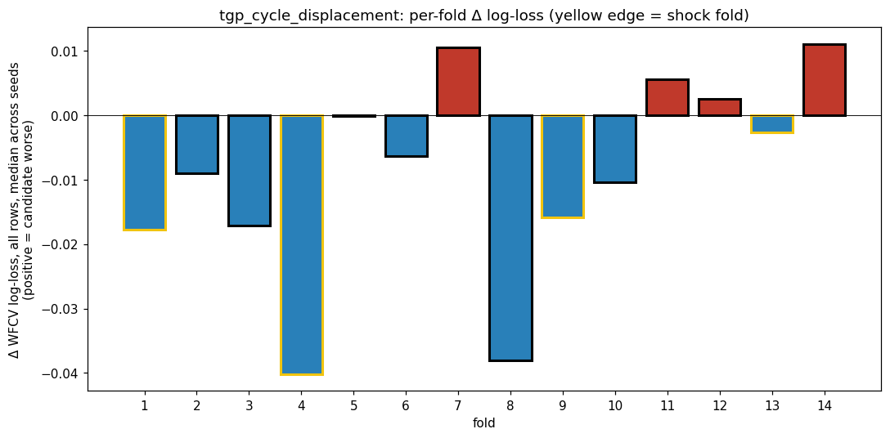
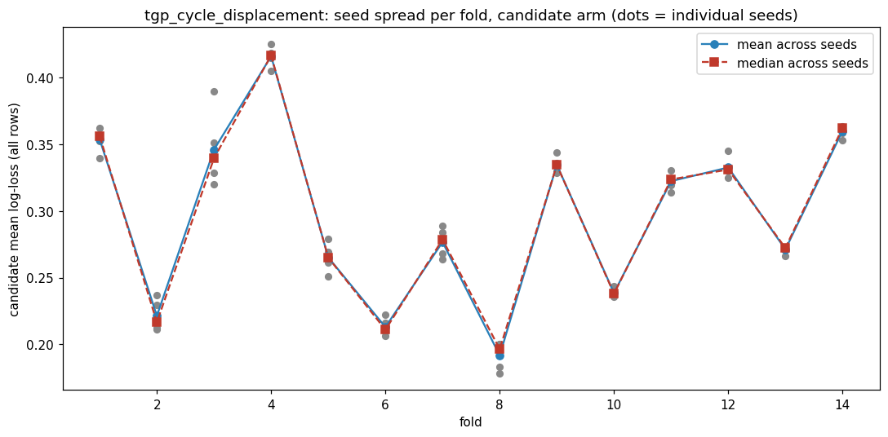
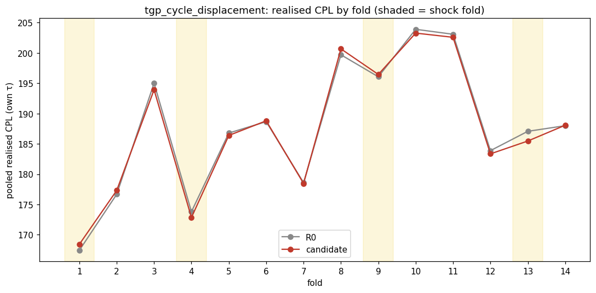
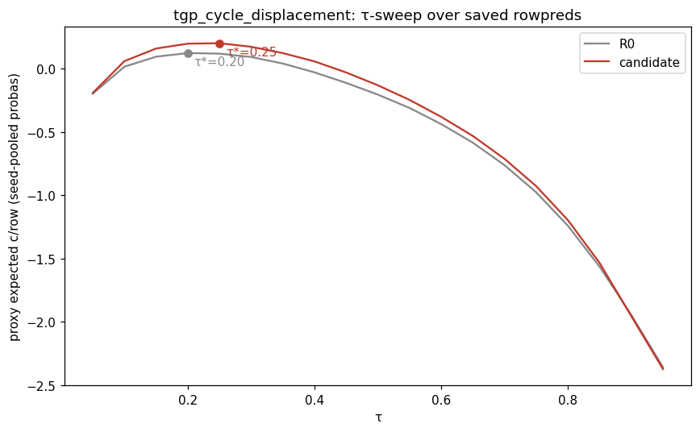
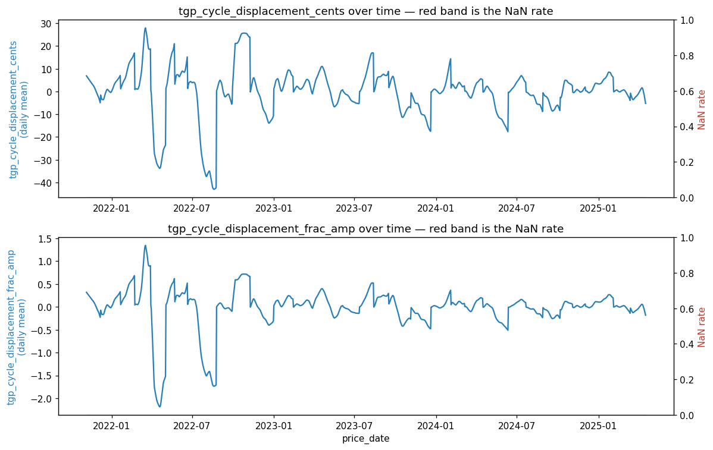
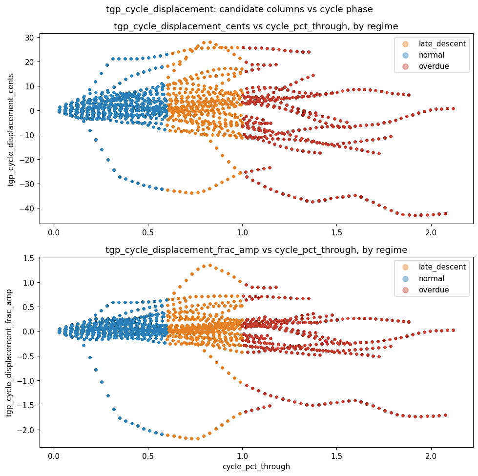
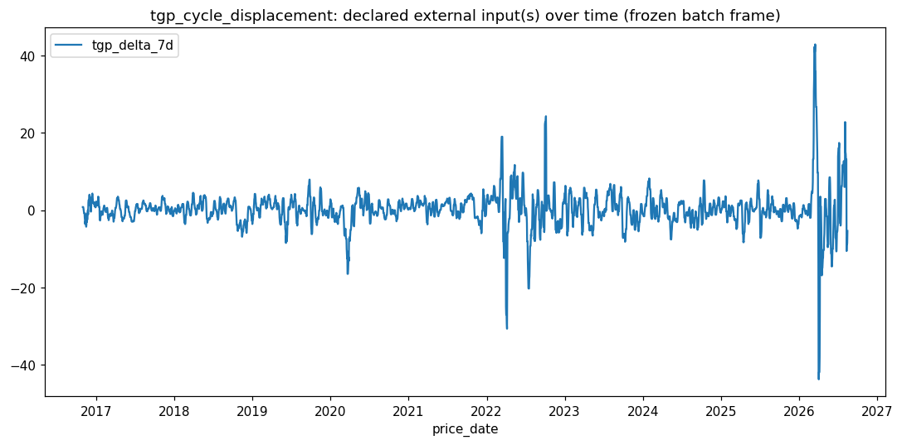

# batch1 / tgp_cycle_displacement

- **Date:** 2026-08-15 (snapshot) / dossiered 2026-08-28
- **Branch:** main
- **SHA:** 4a2016dc8b5cad4dab661801bc789336e10b5e65
- **Status:** done — **contradicted signature, favourable headline**
- **Bead:** fps-2sf
- **Cadence:** `50/3.571/1d/10%` (batch1's canonical daily cadence)

## Hypothesis

The retail trough is bounded below by the wholesale floor, so how far the floor
has MOVED since this cycle's retail peak sets how deep this particular trough
can go. Neither prior TGP expression asks this: `station_minus_tgp_cents`
reads today's floor LEVEL (rejected — accurate when the floor is stable,
misleading when moving); `tgp_delta_7d` reads the floor's velocity over a
fixed 7-day window unrelated to where the retail cycle sits (inconclusive).
Anchoring the displacement to the cycle's own peak (`tgp_cycle_displacement_cents`,
`tgp_cycle_displacement_frac_amp`) makes it a depth-remaining statistic
instead of a level or a fixed-window momentum term.

**Predicted signature:** on rows where the floor has fallen a long way since
the peak, the model should WAIT past the point the lock would buy (the trough
ahead is deeper than the network clock implies); where the floor has been
flat or risen, it should buy earlier. **Expect concentration on NON-SHOCK
(normal) folds** — the mechanism is about floor-set trough depth in an
ordinary cycle, and shock folds are where the prior TGP gap candidate
measurably HURT. **A shock-concentrated win would be evidence AGAINST the
stated mechanism, and should be read as such.** Magnitude expectation: small
(0.03–0.26 c/L, per `results.csv` history), and both prior TGP expressions
landed inside the noise band.

## How to invoke this script

```bash
PYTHONPATH=. uv run python -m experiments.pipeline.runner \
  --batch-dir experiments/batches/batch1 \
  --candidate experiments/candidates/batch1/tgp_cycle_displacement.py
```

## Facts

Transcribed from `facts.json` — no new arithmetic.

**Provenance:** batch `batch1`, snapshot 2026-08-15, seeds [42, 43, 44, 45, 46]
(WFCV screen only — the realised arbiter ran on the single seed `42`, so
every `delta_cpl_own`/`delta_cpl_held` figure below is one draw with no error
bar), wall 1027.1s, status `graded`, 54-column baseline (`54:1a6ec2d84a69`).

**Headline (realised CPL, held τ — the arbiter):**

| | R0 | candidate | delta |
|---|---|---|---|
| CPL held | 187.8211 | 187.6196 | **-0.2015** |

`effect_resolved`: **true**.

**WFCV log-loss** (descriptive colour, NOT the arbiter): Δll_all mean
-0.0091, Δll_hard25 mean -0.0411. Both favour the candidate.

**Zone (regime axis, the candidate's declared target — safe to cut; a fold
is an independent simulation, not a row-label slice):**

| | target (normal) | other (shock) |
|---|---|---|
| delta_cpl_own | -0.1392 | -0.3405 |
| n_fills | 1514 | 663 |

`resolved`: **false** — the "other" (shock) zone is MORE negative than the
declared target (normal) zone, the opposite of the predicted concentration.

**Per-fold:**

| fold | regime | n_fills | delta_cpl_own |
|---|---|---|---|
| 1 | shock | 190 | +0.9884 |
| 2 | normal | 186 | +0.6307 |
| 3 | normal | 106 | -1.0892 |
| 4 | shock | 217 | -0.9512 |
| 5 | normal | 167 | -0.3970 |
| 6 | normal | 135 | +0.1343 |
| 7 | normal | 219 | -0.1152 |
| 8 | normal | 88 | +0.9725 |
| 9 | shock | 112 | +0.3879 |
| 10 | normal | 96 | -0.6291 |
| 11 | normal | 160 | -0.5000 |
| 12 | normal | 175 | -0.5325 |
| 13 | shock | 140 | **-1.6021** |
| 14 | normal | 169 | +0.0771 |

No cell is suppressed (`min_row_cell_n` = 30, smallest cell here is 88).
`per_axis` is `null` — this candidate declared no `add_axis` beyond the
regime split above, so there is no path-coupled per-row zone to caveat.

Within the 4 shock folds the pattern is mixed, not uniform: folds 1 and 9
hurt the candidate (+0.99, +0.39), while folds 4 and 13 help it (-0.95,
-1.60). Fold 13 alone is the single largest cell in either regime and
accounts for most of the shock-regime aggregate's size.

**Decision flips** (`facts["decision_flips"]`, diffs R0's and the
candidate's `fills.parquet` directly on `(fold, station_code, date)`): **423
total flips**. Per fold:

| fold | regime | n_baseline_only | n_candidate_only | flip_cpl_baseline | flip_cpl_candidate | flip_cpl_delta |
|---|---|---|---|---|---|---|
| 1 | shock | 3 | 5 | 176.57 | 175.98 | -0.59 |
| 2 | normal | 40 | 26 | 181.83 | 186.45 | +4.63 |
| 3 | normal | 99 | 14 | 198.89 | 210.80 | +11.91 |
| 4 | shock | 38 | 16 | 177.62 | 183.82 | +6.21 |
| 5 | normal | 33 | 15 | 188.28 | 189.06 | +0.78 |
| 6 | normal | 5 | 5 | 179.72 | 182.33 | +2.61 |
| 7 | normal | 17 | 1 | 177.47 | 165.90 | -11.57 |
| 8 | normal | 10 | 11 | 189.01 | 200.90 | +11.89 |
| 9 | shock | 3 | 5 | 197.57 | 185.50 | -12.07 |
| 10 | normal | 12 | 24 | 206.55 | 198.66 | -7.90 |
| 11 | normal | 3 | 2 | 212.45 | 203.61 | -8.83 |
| 12 | normal | 11 | 1 | 185.73 | 194.90 | +9.17 |
| 13 | shock | 12 | 6 | 198.61 | 180.48 | **-18.12** |
| 14 | normal | 3 | 3 | 178.85 | 185.47 | +6.62 |

The flip-level picture is high-variance in both regimes (swings from -18.12
to +11.91), not a clean shock/normal split. Net shock-flip average
(-6.14 c/L, pulled by folds 9 and 13) is still more favourable than the
net normal-flip average (+1.93 c/L), consistent with the per-fold `delta_cpl_own`
picture above.

**Seed stability:** 4 cells exceed 5× the cohort-median seed_std. Three are
on R0 (folds 2 and 3, `all` cohort; fold 2, `hard25` cohort) — a property of
the window, not the candidate. **One is on the CANDIDATE arm** (fold 3,
`hard25` cohort), so per the fold × arm rule, here is that comparison rather
than prose:

| fold | cohort | R0 seed_std | candidate seed_std |
|---|---|---|---|
| 2 | all | 0.0458 (flagged, 5.61×) | not flagged |
| 3 | all | 0.0451 (flagged, 5.53×) | not flagged |
| 2 | hard25 | 0.1326 (flagged, 5.17×) | not flagged |
| 3 | hard25 | not flagged | **0.1564 (flagged, 6.10×)** |

Fold 3's hard25 cohort is flagged on the candidate arm only — R0 was not
flagged there. That is the within-fold R0-vs-candidate jump the routine
treats as a redundancy tell: the added columns may be destabilising an
otherwise-ordinary fit in exactly the fold with this candidate's worst
`delta_cpl_own` reading (-1.09, the most favourable normal-fold cell).
Every `seed_std` above is WFCV **log-loss**, not CPL — never read this as
instability in `delta_cpl_own`, which is not seed-measured at all.

**Validation:** PIT passed (differential PIT truncation test found no leak).
INPUTS check passed. Candidate column NaN rate 0.0% for both columns.
`extra_feature_provider_miss_rate`: **9.63%** (607/6300 hits+misses) — this
is the REPLAY's own coverage, distinct from the clean 0.0% offline NaN rate
above, and it is the same 607-miss batch-wide gap documented in
`experiments/candidates/batch1/lga_trough_propagation/README.md` § Review
addendum (Blue Mountains preferred-station outages, folds 1–8 only, not
specific to this candidate).

**Noise floor** (`experiments/batches/batch1/noise_floor.json`, 10 draws at
arity 3 — **wider than this candidate's own 2-column arity**,
`floor_arity_exceeds_run`: **true**, excess 1 column. This is a stricter
ruler than the candidate's own arity would require, which only raises the
bar, never lowers it — a candidate that clears it has not been shown to
fail against an easier one, only a harder one): band mean +0.0251 c/L, band
std 0.0999 c/L. The candidate's -0.2015 c/L sits at the **100th
percentile** of the 10 observed draws
(`candidate_percentile_better_than_noise` = 100.0), and the parametric call
is `z = -2.2676` against threshold `t = 1.9226` — **past the bar, in the
favourable direction** (`abs(z)` > `t`, sign favourable).

Bar in c/L, all four required components: **`single_candidate_bar_cpl_held`
= -0.1670 c/L** (the detection threshold in the units the rest of the
project quotes, comparable against `results.csv`'s 0.03–0.26 c/L history).
**`bar_draw_count_shift_cpl_held` = -0.0278 c/L** (how much of that bar is
draw-count thinness, the `df = n_draws - 1` t-penalty). **`bar_reuse_shift_cpl_held`
= 0.0** (no reuse-hardening component at this arity/bank). **`floor_arity_excess`
= 1** (the ruler is 1 column wider than the run).

**Redundancy** (`facts["redundancy"]`, `available`: true): `block_r2` =
0.574, `max_column_r2` = **0.583** (`tgp_cycle_displacement_cents`) against
49 lock predictors, with `tgp_cycle_displacement_frac_amp` close behind at
0.565. Both columns are meaningfully reconstructible from the existing lock
— `predictors_dropped` (columns too collinear to include as predictors in
the redundancy fit) is entirely the `days_since_trough_entry_*` LGA family
(Bayside, Botany Bay, Hunters Hill, Lane Cove, Waverley), which is the same
trough-timing family this candidate's mechanism (floor displacement since
the retail peak) is adjacent to.









## Judgement

**Signature grading: contradicted.** The realised headline is favourable and
clears this batch's single-candidate noise band on the good-direction side
(z = -2.2676 past t = 1.9226, against a ruler one column wider than the
candidate's own arity) — a stronger result than either prior TGP expression,
both of which sat inside their noise bands. But the *where* of the effect is
the opposite of what was predicted: the candidate's own signature named
concentration on **normal** folds as the expected pattern and explicitly
pre-registered a **shock**-concentrated win as evidence against its
wholesale-lead mechanism. What was measured is exactly that: shock delta_cpl_own
(-0.34) is larger in magnitude than normal (-0.14), and the zone's own
`resolved` flag reads `false` for the same reason. The shock aggregate is
not even a clean shock story on its own terms — 2 of 4 shock folds hurt the
candidate, and fold 13 alone drives most of the favourable shock number —
but as measured, the pattern the candidate itself said would falsify its
mechanism is the pattern that showed up.

Per `docs/routines/dossier.md`'s guardrail, none of the per-fold or
decision-flip colour above overrides this — it explains why the aggregate
looks the way it does, not a second arbiter.

**not_tested:**

- Whether the shock-fold gain is fold-13-specific (-1.60 c/L alone, the
  single largest cell in either regime) rather than a genuine shock
  mechanism — 2 of the 4 shock folds (1, 9) actually hurt the candidate, so
  the regime aggregate is not a uniform shock story.
- Whether testing the actual claim — decision timing keyed to the
  *magnitude* of floor displacement since the peak, not the coarse
  shock/normal regime label — would recover the predicted normal-fold
  concentration. No per-axis breakdown by displacement magnitude was built
  for this run; `per_axis` is `null`.
- Whether the ~58% max per-column R² against the lock (concentrated
  entirely in the `days_since_trough_entry_*` family) means this is
  substantially a proxy for existing trough-timing columns rather than new
  information — the redundancy check flags the column, not the mechanism,
  and the one candidate-arm seed-instability flag (fold 3, hard25) lands in
  exactly the fold with this candidate's best normal-fold `delta_cpl_own`
  reading, which is consistent with either story.
- Per `fps-1l1`: whether the model's own SHAP orientation would corroborate
  or refute the wholesale-lead story — `facts.json` has no field for this,
  so the mechanism itself (as opposed to the regime-location prediction) is
  untestable with this pipeline as built.

**Recommendation:** not a graduation call on this run's own terms — the
predicted mechanism's most specific, falsifiable claim (normal-fold
concentration) is contradicted by its own criterion — but the headline is
real, favourable, and clears noise more convincingly than either prior TGP
expression. Worth a second look if a displacement-magnitude axis (rather
than the coarse regime split) can be built, and worth checking against the
`days_since_trough_entry_*` family directly before treating this as new
information rather than a proxy for it.

## Followups

- A per-axis breakdown keyed on displacement *magnitude* (not just the
  regime label) would let a future run test the actual predicted mechanism
  directly rather than through the coarse shock/normal proxy.
- `fps-1l1` (SHAP importance/orientation in `facts.json`) remains open and
  would let a future run test the wholesale-lead mechanism itself.
